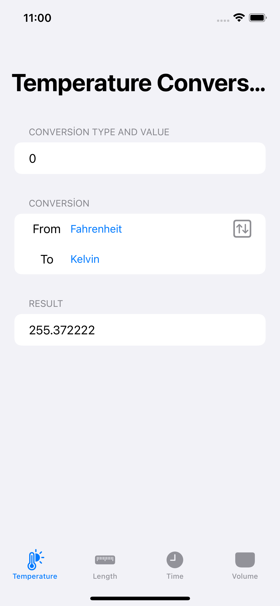
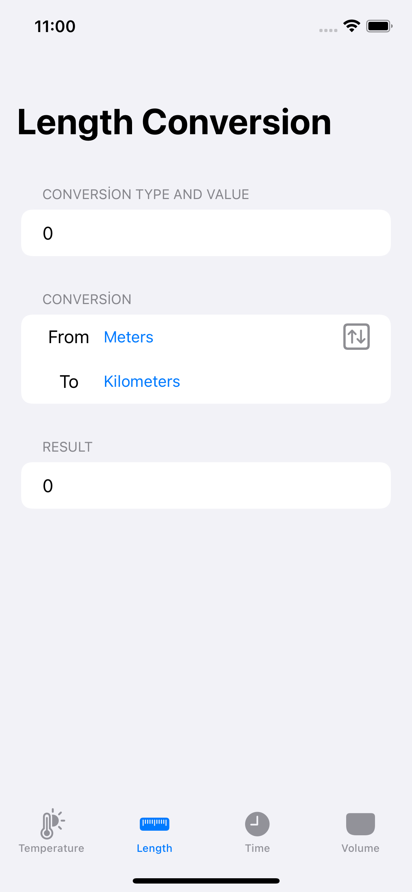
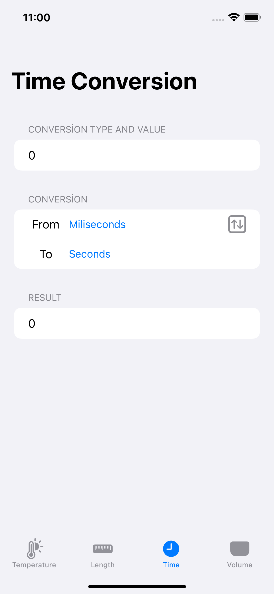
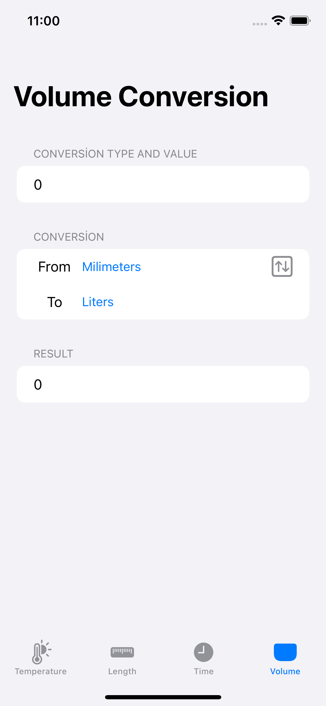

# Gün Gün SwiftUI Öğrenme Maceram - Gün 19 🚀
[Hacking With Swift - 100 days of SwiftUI](https://www.hackingwithswift.com/100/swiftui) eğitimini tamamlama maceramı aynı zamanda yazıya da döküyorum ✌️

### Objective
- [x] An app that handles unit conversions: users will select an input unit and an output unit, then enter a value, and see the output of the conversion.

Which units you choose are down to you, but you could choose one of these:

* Temperature conversion: users choose Celsius, Fahrenheit, or Kelvin.
* Length conversion: users choose meters, kilometers, feet, yards, or miles.
* Time conversion: users choose seconds, minutes, hours, or days.
* Volume conversion: users choose milliliters, liters, cups, pints, or gallons.

### Screenshots

Bu projenin ilgili sayfalarına aşağıdaki bağlantılardan ulaşabilirsin 👇
* [27.01.2021 🏂](https://canbi.me/27-01-2021-b8fe810ccfaf4cd6ac54485b3af0b0f8)

**SwiftUI öğrenme maceramın tamamına göz atmak istersen görsele tıklayabilirsin**👇

