# Gün Gün SwiftUI Öğrenme Maceram - Gün 35 🚀
[Hacking With Swift - 100 days of SwiftUI](https://www.hackingwithswift.com/100/swiftui) eğitimini tamamlama maceramı aynı zamanda yazıya da döküyorum ✌️

    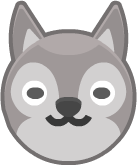     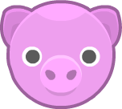   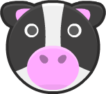   

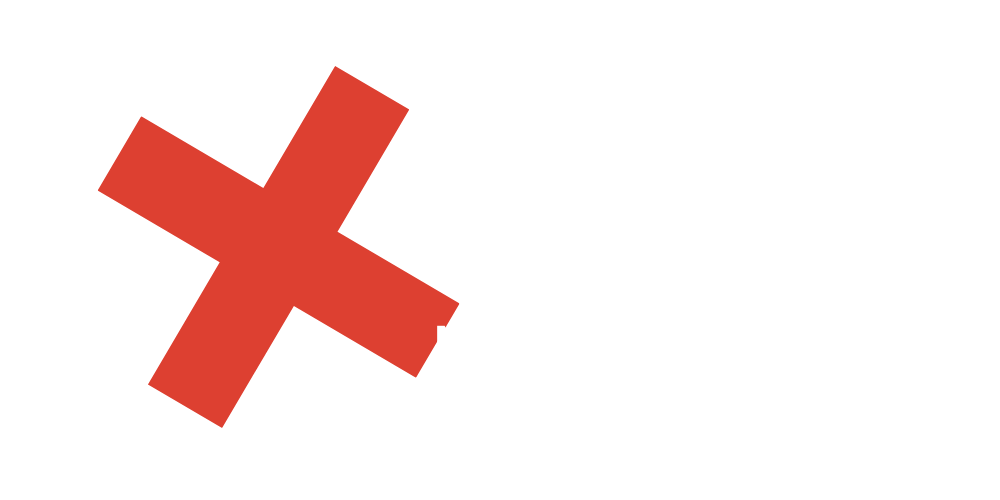

### Objective
- [x] Build an “edutainment” app for kids to help them practice multiplication tables – “what is 7 x 8?” and so on. 

### What is "Edutainment"?
Edutainment apps are educational at their code, but ideally have enough playfulness about them to make kids want to play.

### How to Play
* The player needs to select which multiplication tables they want to practice. This could be pressing buttons, or it could be an “Up to…” stepper, going from 2 to 12.
* The player should be able to select how many questions they want to be asked: 5, 10, or 20.
* You should randomly generate as many questions as they asked for, within the difficulty range they asked for.

### Dark UI Screenshots
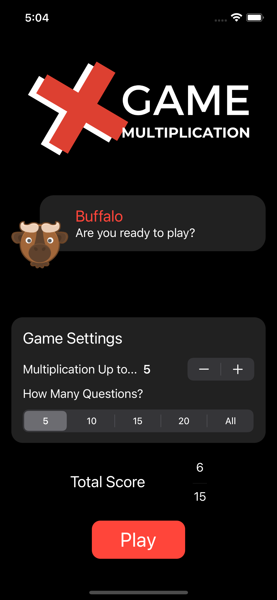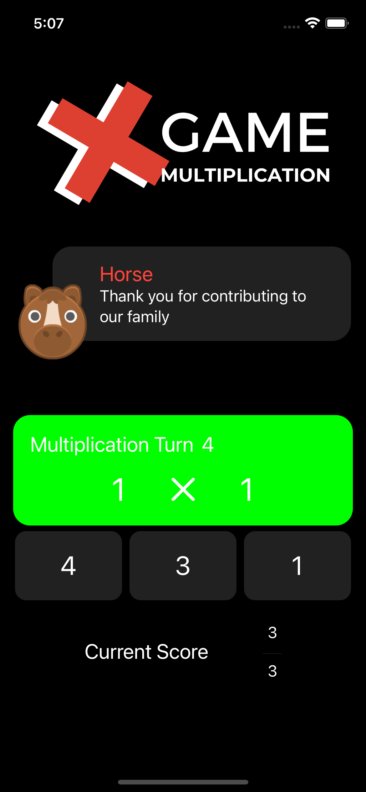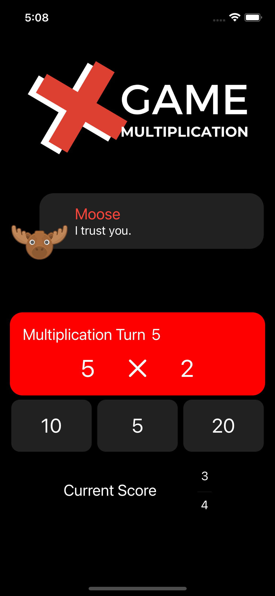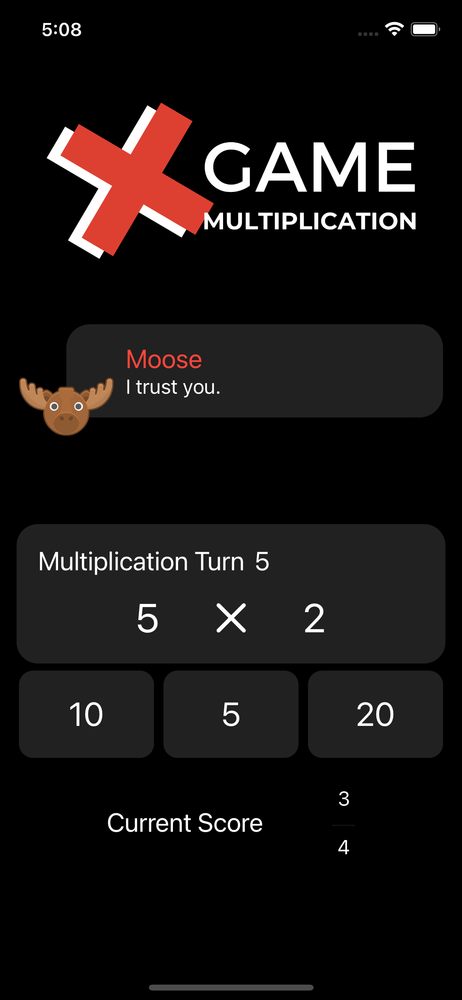

### Light UI Screenshots
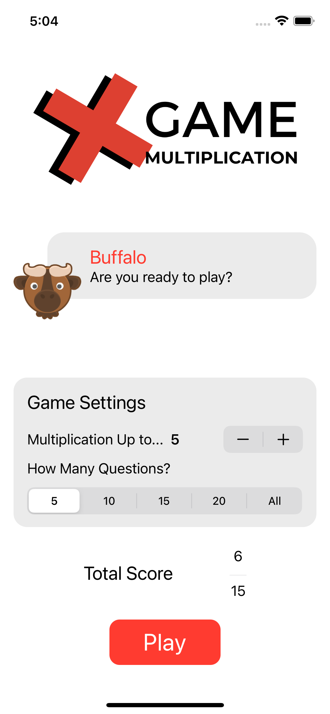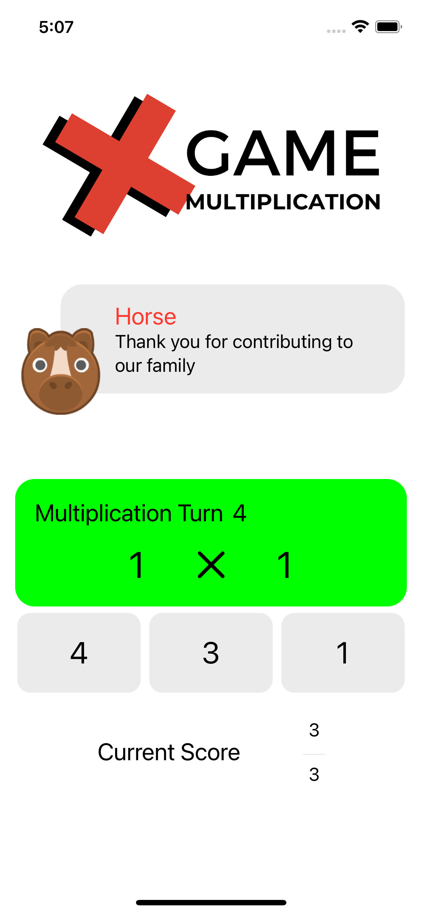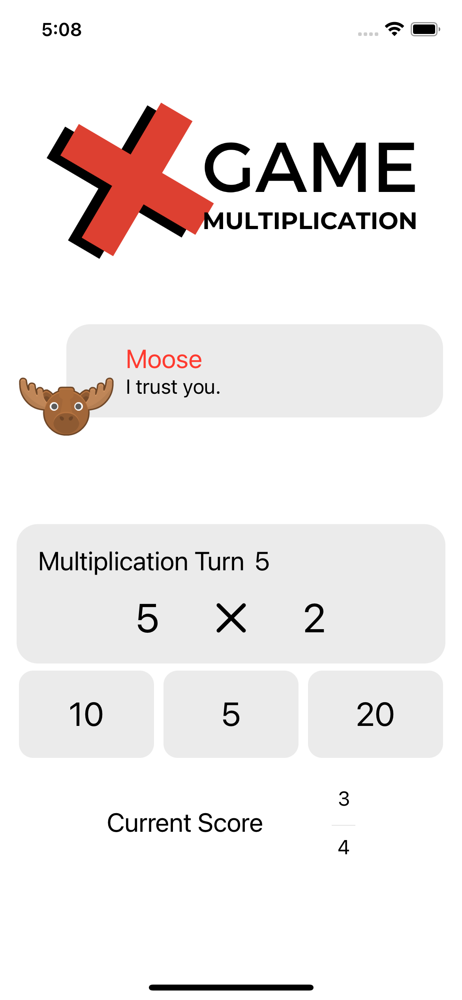

Bu projenin ilgili sayfalarına aşağıdaki bağlantılardan ulaşabilirsin 👇
* [02.02.2022 2️⃣](https://canbi.me/02-02-2022-2-ae06aaea8335489dbeecfa2709ac24a8)

**SwiftUI öğrenme maceramın tamamına göz atmak istersen görsele tıklayabilirsin**👇

