# Gün Gün SwiftUI Öğrenme Maceram - Gün 47 🚀
[Hacking With Swift - 100 days of SwiftUI](https://www.hackingwithswift.com/100/swiftui) eğitimini tamamlama maceramı aynı zamanda yazıya da döküyorum ✌️

### Objective
Building a habit-tracking app, for folks who want to keep track of how much they do certain things. That might be learning a language, practicing an instrument, exercising, or whatever – they get to decide which activities they add, and track it however they want.

### Dark UI Screenshots
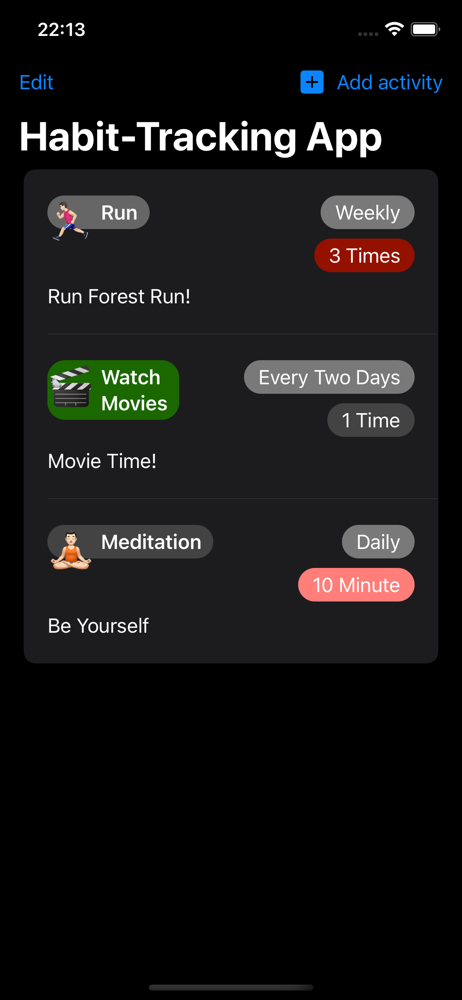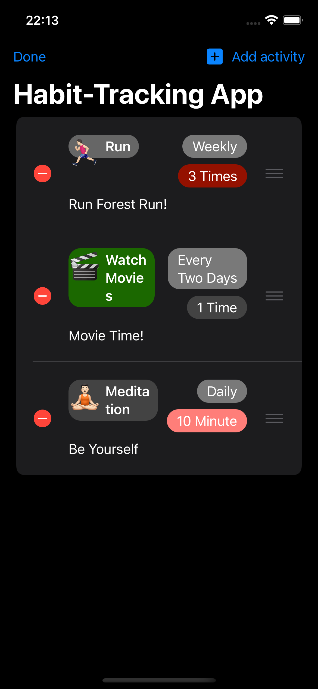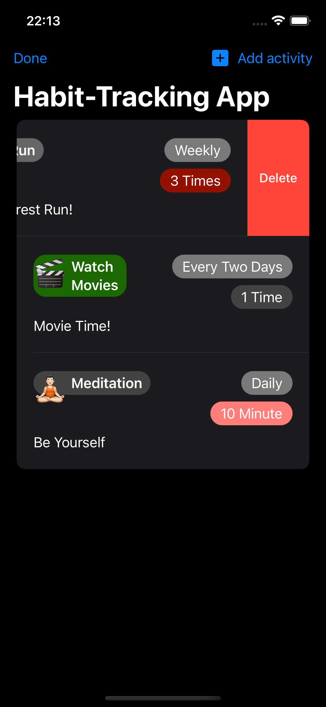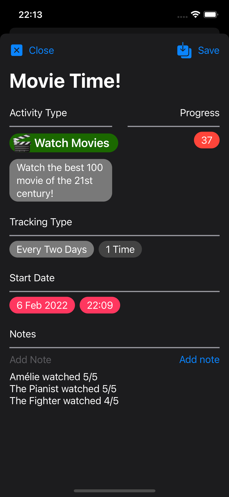
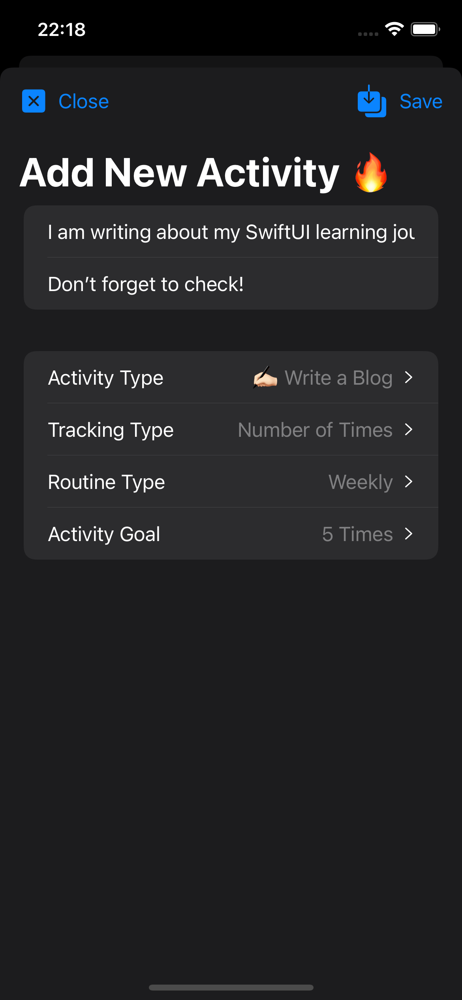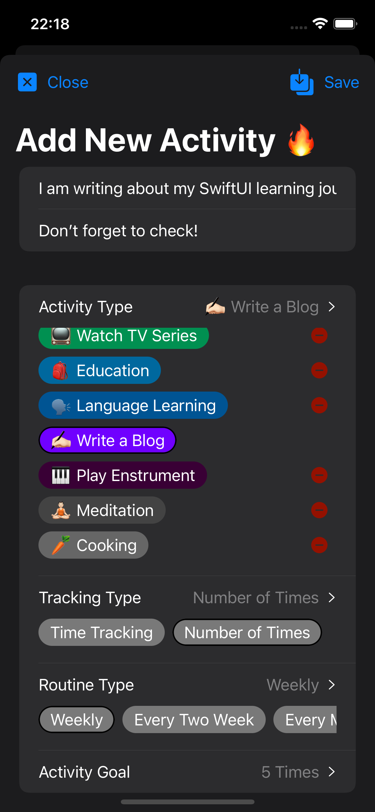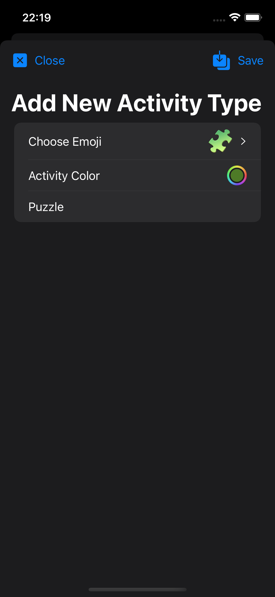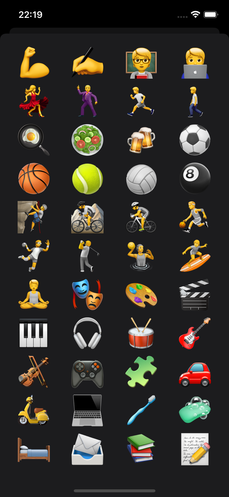

### Light UI Screenshots
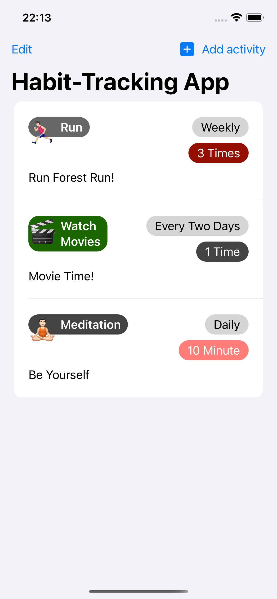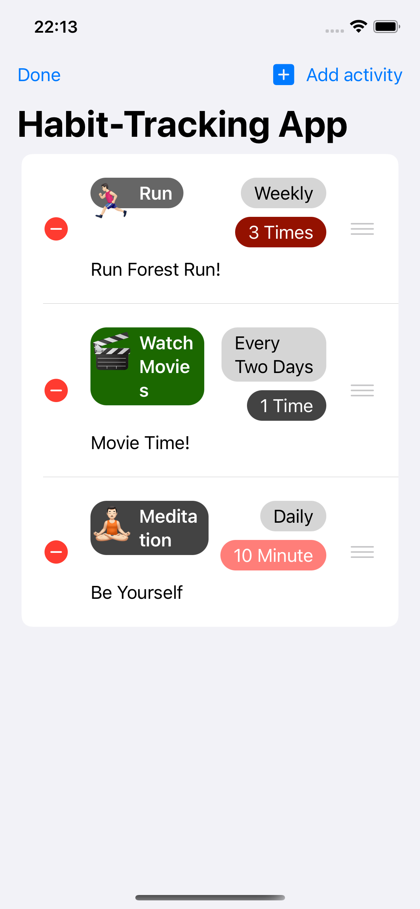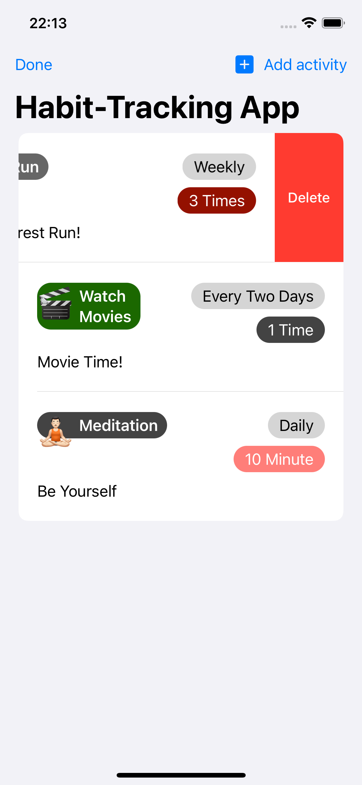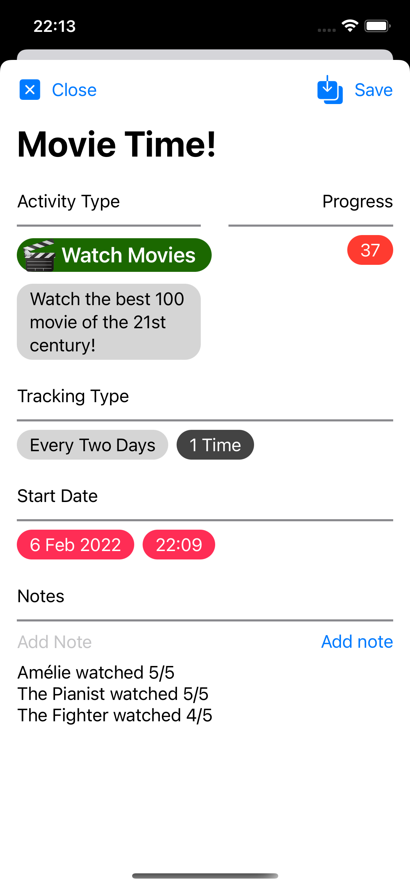
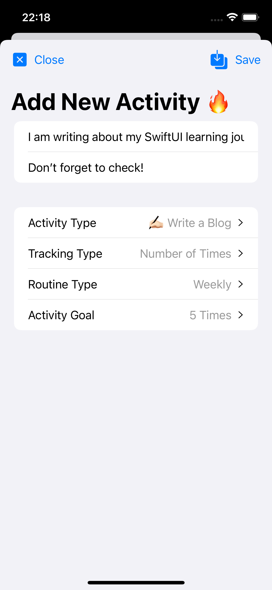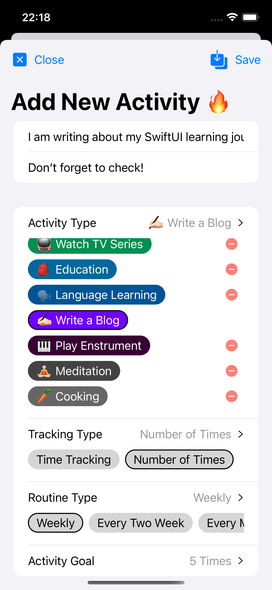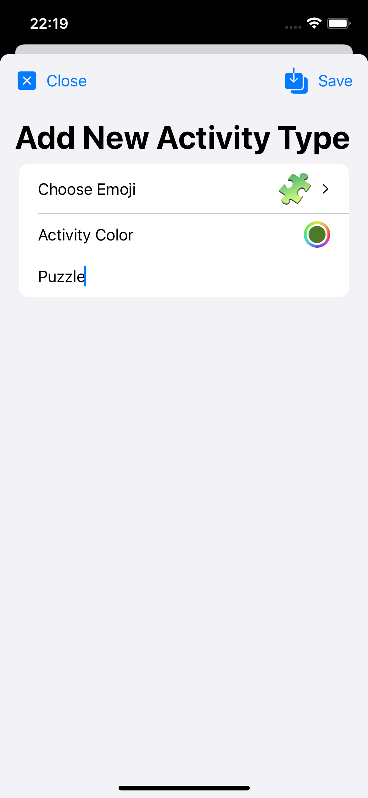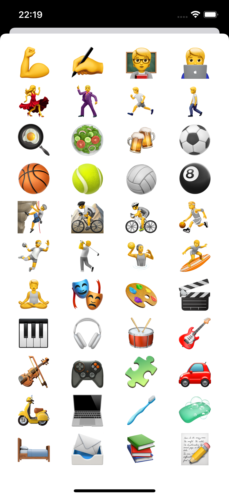

Bu projenin ilgili sayfalarına aşağıdaki bağlantılardan ulaşabilirsin 👇
* [06.02.2022 💥](https://canbi.me/06-02-2022-cff1c734a8d74415b9657c9458ea8246)

**SwiftUI öğrenme maceramın tamamına göz atmak istersen görsele tıklayabilirsin**👇

