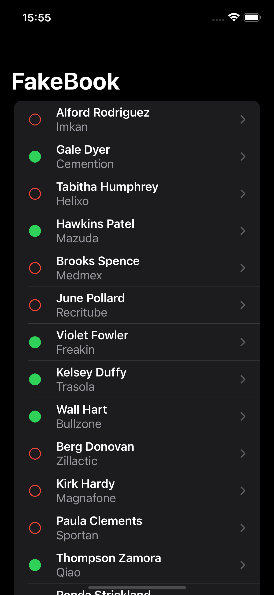
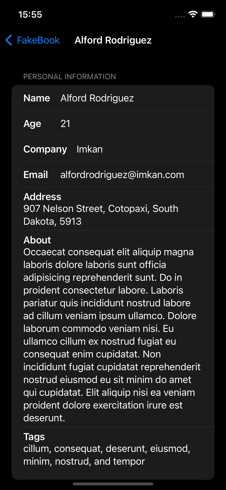
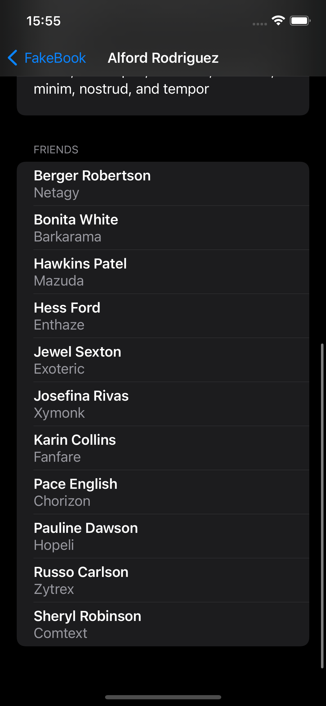
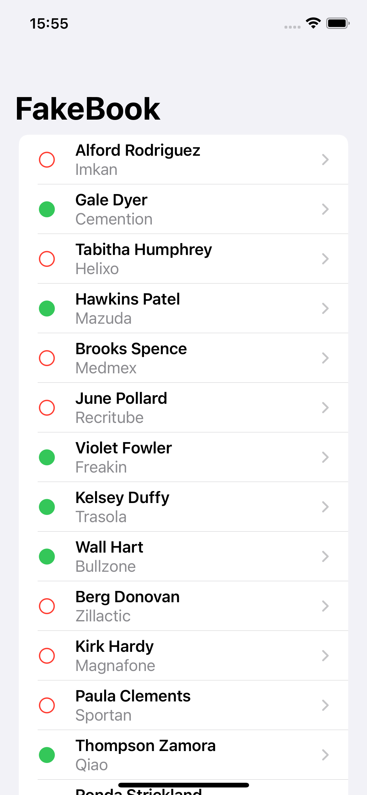
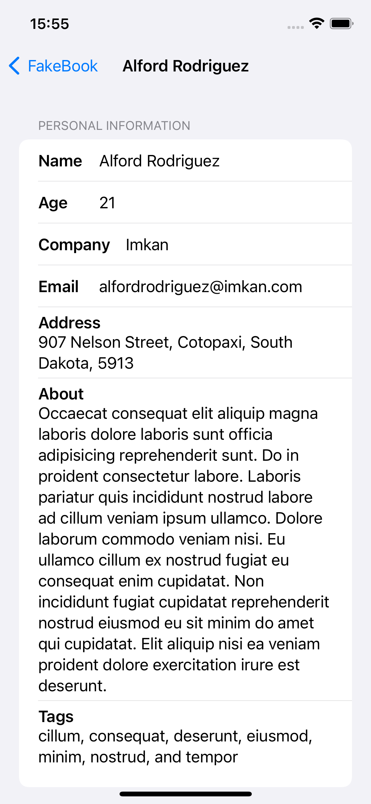
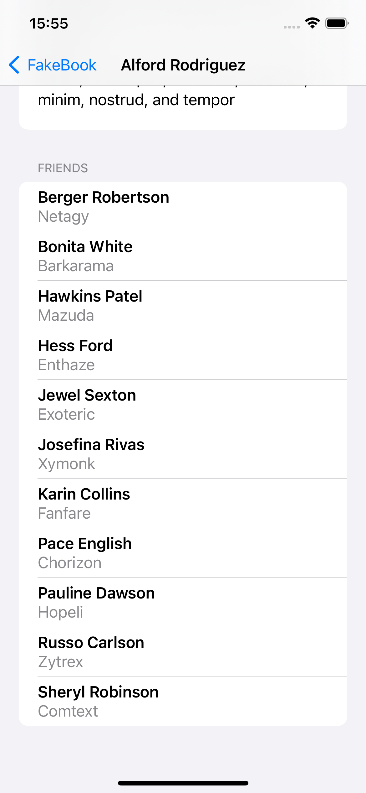

# Gün Gün SwiftUI Öğrenme Maceram - Gün 60 🚀
[Hacking With Swift - 100 days of SwiftUI](https://www.hackingwithswift.com/100/swiftui) eğitimini tamamlama maceramı aynı zamanda yazıya da döküyorum ✌️

### Objective
Use URLSession to download some JSON from the internet, use Codable to convert it to Swift types, then use NavigationView, List, and more to display it to the user.

### Dark UI Screenshots

### Light UI Screenshots

Bu projenin ilgili sayfalarına aşağıdaki bağlantılardan ulaşabilirsin 👇
* [09.02.2022 🍱](https://canbi.me/09-02-2022-3537e12aad024c33a029ccb341df9903)

**SwiftUI öğrenme maceramın tamamına göz atmak istersen görsele tıklayabilirsin**👇

