# Gün Gün SwiftUI Öğrenme Maceram - Gün 77-78 🚀
[Hacking With Swift - 100 days of SwiftUI](https://www.hackingwithswift.com/100/swiftui) eğitimini tamamlama maceramı aynı zamanda yazıya da döküyorum ✌️

### Objective
An app that asks users to import a picture from their photo library, then attach a name to whatever they imported. The full collection of pictures they name should be shown in a List, and tapping an item in the list should show a detail screen with a larger version of the picture.

### Dark UI Screenshots
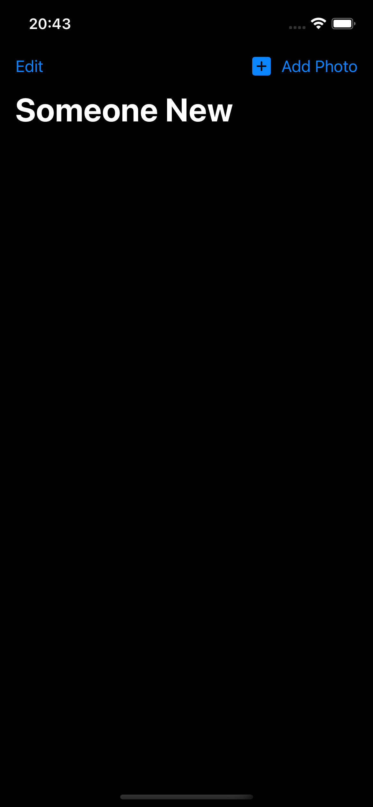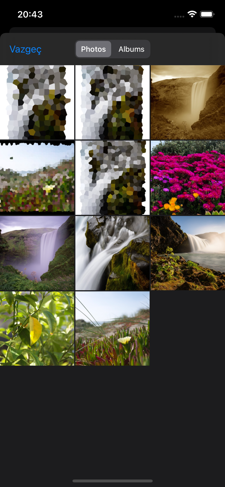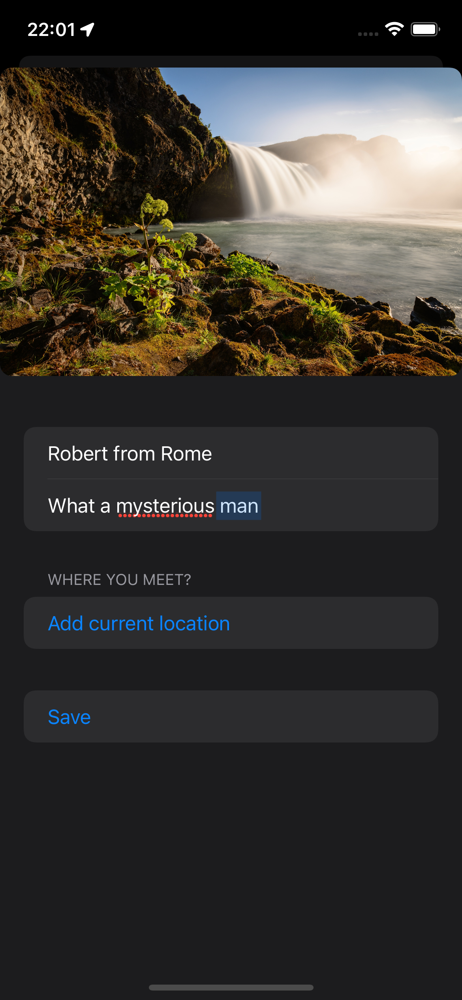 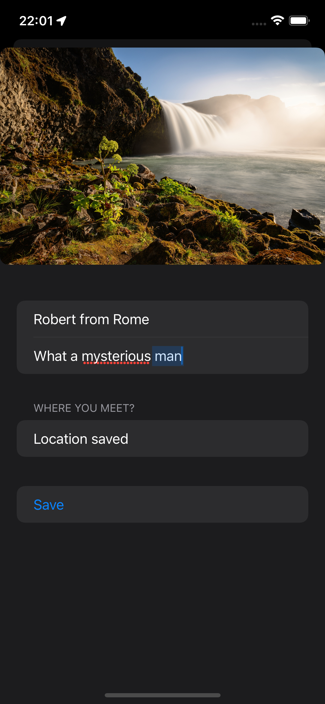 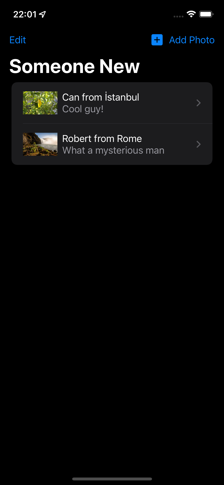 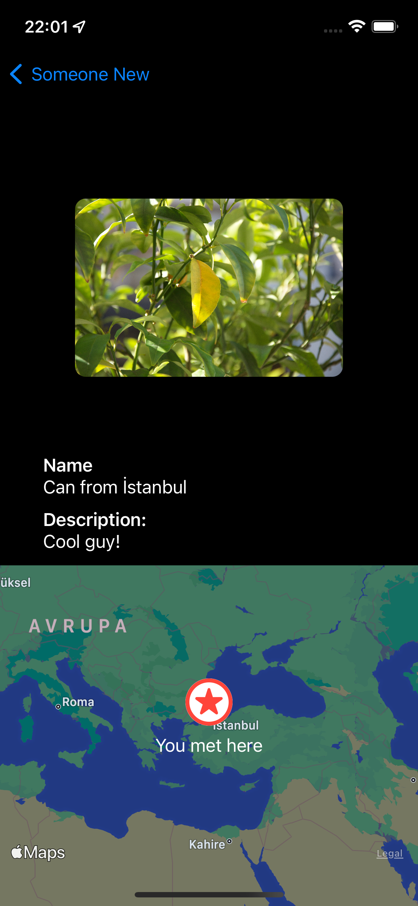

### Light UI Screenshots
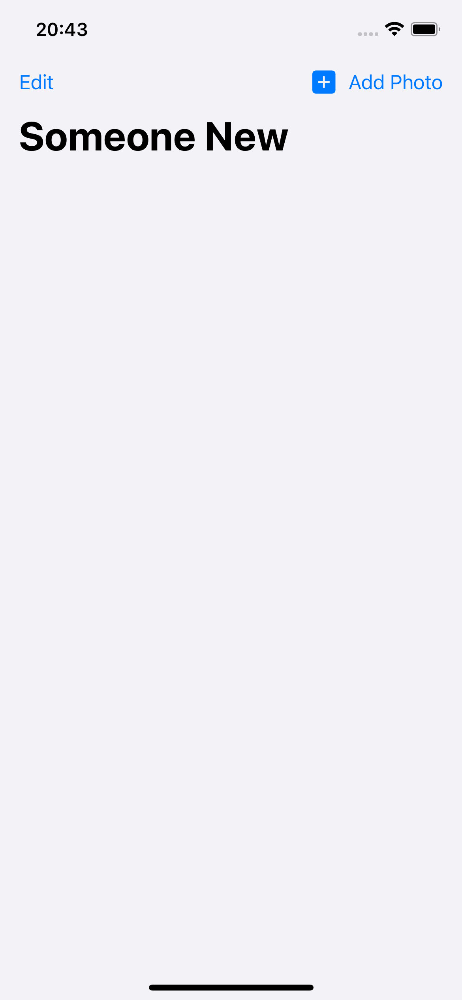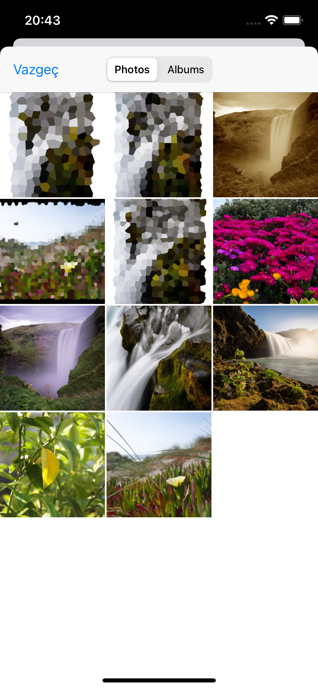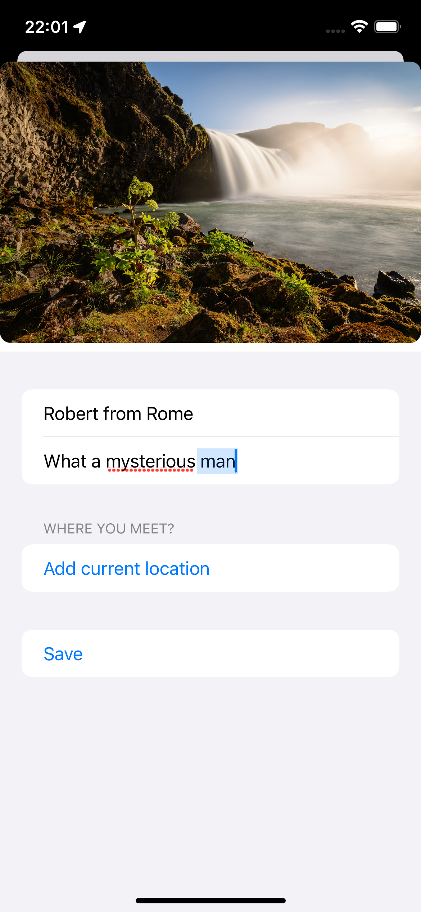 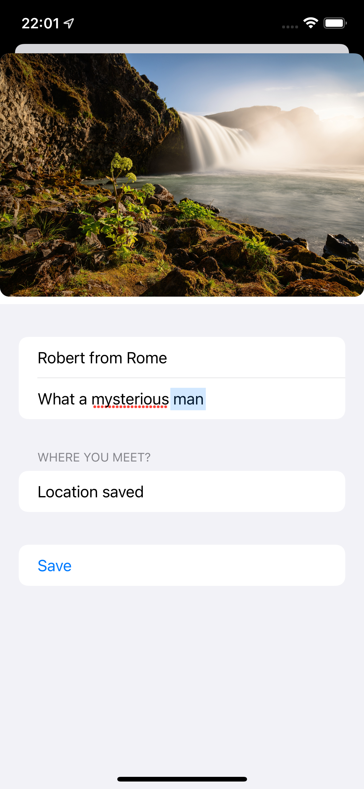 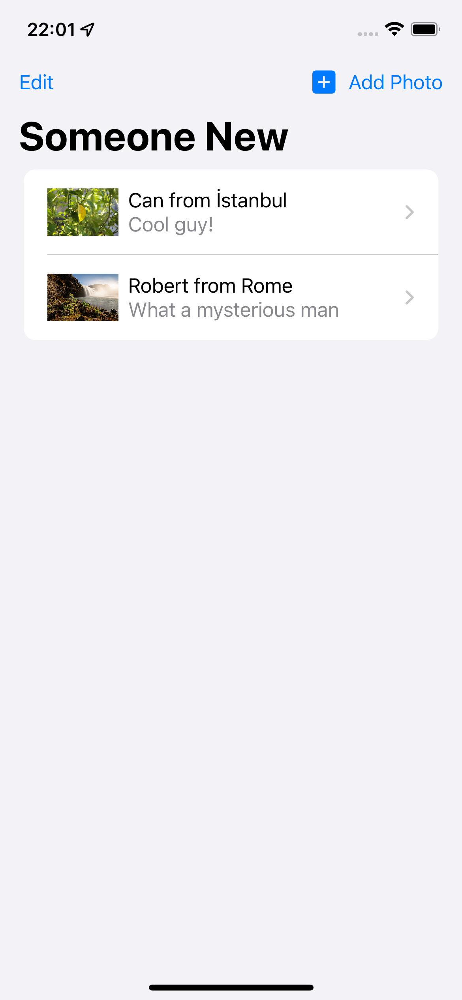 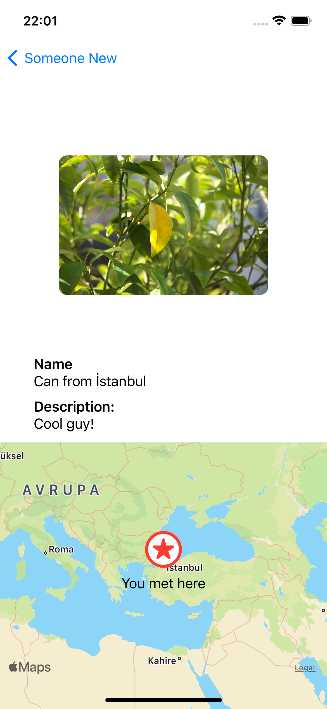

Bu projenin ilgili sayfalarına aşağıdaki bağlantılardan ulaşabilirsin 👇
* [18.02.2022 ⏱️](https://canbi.me/18-02-2022-b5e176f4f7304a9c9a1bfd874a35549e)

**SwiftUI öğrenme maceramın tamamına göz atmak istersen görsele tıklayabilirsin**👇

