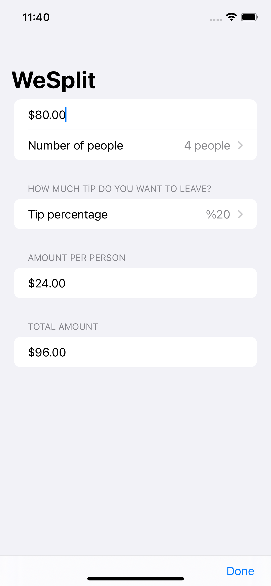

# Gün Gün SwiftUI Öğrenme Maceram - Gün 17-18 🚀
[Hacking With Swift - 100 days of SwiftUI](https://www.hackingwithswift.com/100/swiftui) eğitimini tamamlama maceramı aynı zamanda yazıya da döküyorum ✌️

### Objective
This project is a check-sharing app that calculates how to split a check based on the number of people and how much tip you want to leave.

### Challanges
- [x] Add a header to the third section, saying “Amount per person”
- [x] Add another section showing the total amount for the check – i.e., the original amount plus tip value, without dividing by the number of people.
- [x] Change the tip percentage picker to show a new screen rather than using a segmented control, and give it a wider range of options – everything from 0% to 100%. Tip: use the range 0..<101 for your range rather than a fixed array.
- [x] Rather than having to type `.currency(code: Locale.current.currencyCode ?? "USD")` in two places, can you make a new property to store the currency formatter? You’ll need to give your property a specific return type in order to keep the rest of your code happy: `FloatingPointFormatStyle<Double>.Currency.`

### Screenshots

Bu projenin ilgili sayfalarına aşağıdaki bağlantılardan ulaşabilirsin 👇
* [19.01.2021 👽](https://canbi.me/19-01-2021-a5a1f9aac3454a08a296b501d2a27a01)
* [20.01.2021 🀄](https://canbi.me/20-01-2021-05f17d4c0ca844aaa058c85d5247b941)

**SwiftUI öğrenme maceramın tamamına göz atmak istersen görsele tıklayabilirsin**👇

