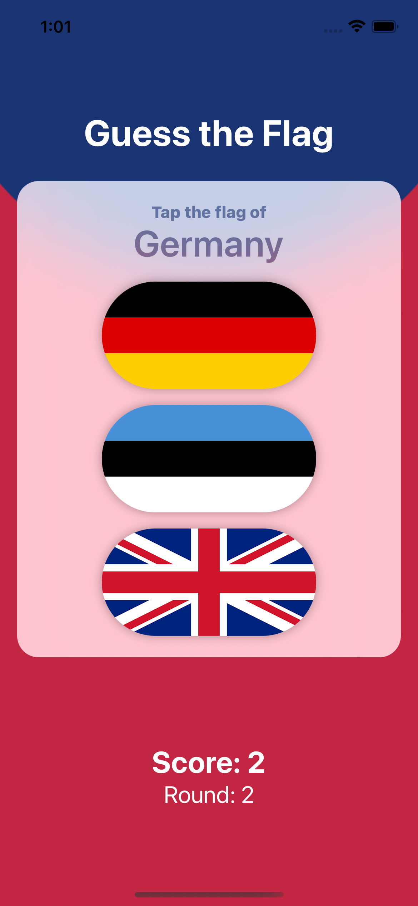
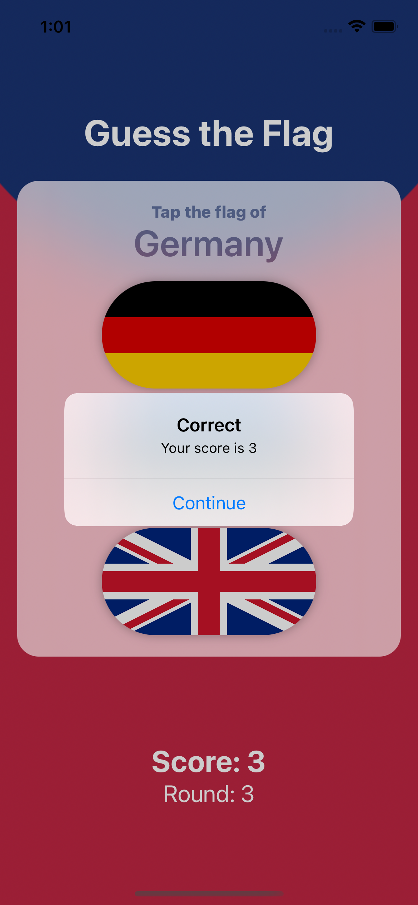
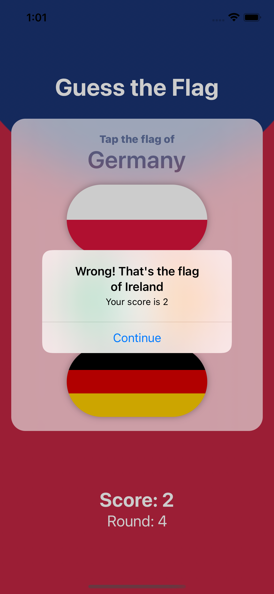
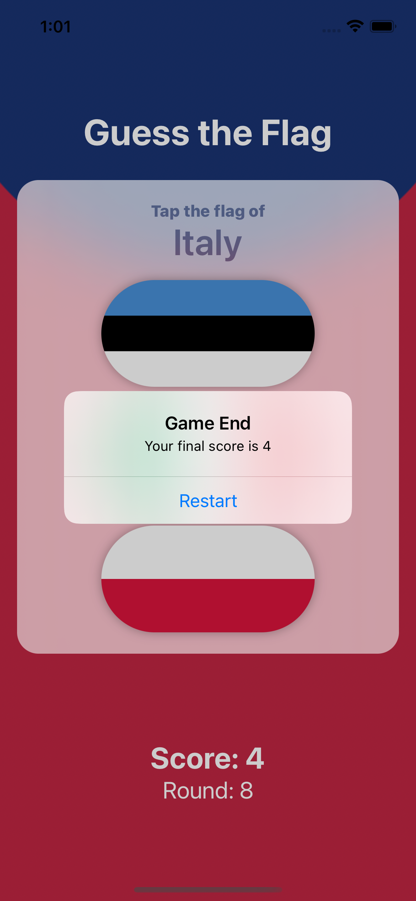

# Gün Gün SwiftUI Öğrenme Maceram - Gün 20-21-22 🚀
[Hacking With Swift - 100 days of SwiftUI](https://www.hackingwithswift.com/100/swiftui) eğitimini tamamlama maceramı aynı zamanda yazıya da döküyorum ✌️

### Objective
Building a guessing game that helps users learn some of the many flags of the world.

### Challanges
- [x] Add an `@State` property to store the user’s score, modify it when they get an answer right or wrong, then display it in the alert and in the score label.
- [x] When someone chooses the wrong flag, tell them their mistake in your alert message – something like “Wrong! That’s the flag of France,” for example.
- [x] Make the game show only 8 questions, at which point they see a final alert judging their score and can restart the game.

**Project 3 Challange**
- [x] Go back to project 2 and replace the `Image` view used for flags with a new `FlagImage()` view that renders one flag image using the specific set of modifiers we had.
- [x] Create a custom `ViewModifier` (and accompanying `View` extension) that makes a view have a large, blue font suitable for prominent titles in a view.

### Screenshots
   

Bu projenin ilgili sayfalarına aşağıdaki bağlantılardan ulaşabilirsin 👇
* [27.01.2021 🏂](https://canbi.me/27-01-2021-b8fe810ccfaf4cd6ac54485b3af0b0f8)

**SwiftUI öğrenme maceramın tamamına göz atmak istersen görsele tıklayabilirsin**👇

