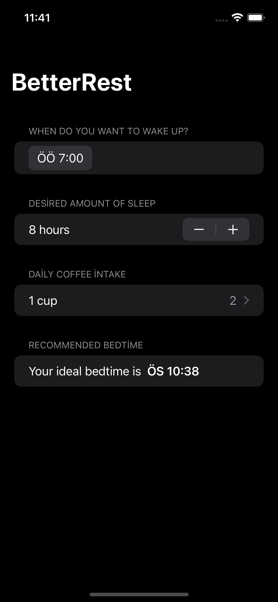
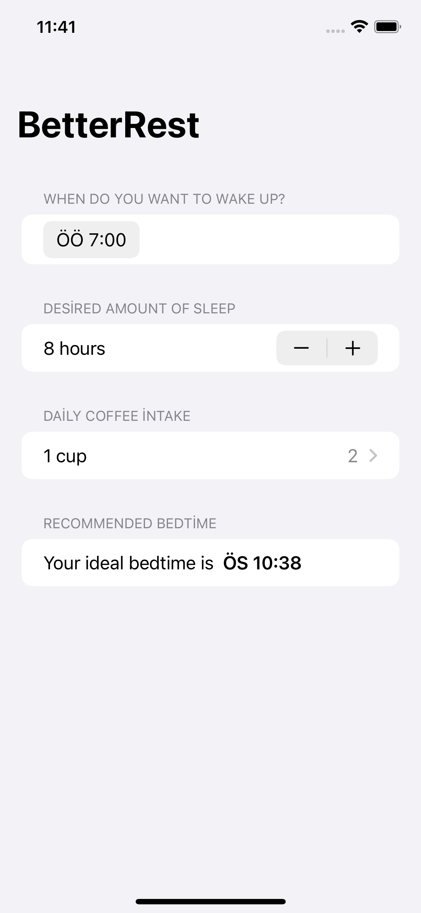

# Gün Gün SwiftUI Öğrenme Maceram - Gün 26-27-28 🚀
[Hacking With Swift - 100 days of SwiftUI](https://www.hackingwithswift.com/100/swiftui) eğitimini tamamlama maceramı aynı zamanda yazıya da döküyorum ✌️

### Objective
Building rms-based app that will ask the user to enter information about wake up time, desired amount of sleep and daily coffee intake and convert that into recommended bedtime.

### Challanges
- [x]  Replace each `VStack` in our form with a `Section`, where the text view is the title of the section. Do you prefer this layout or the `VStack` layout? It’s your app – you choose!
- [x]  Replace the “Number of cups” stepper with a `Picker` showing the same range of values.
- [x]  Change the user interface so that it always shows their recommended bedtime using a nice and large font. You should be able to remove the “Calculate” button entirely.

### Dark UI Screenshots
 

### Light UI Screenshots

Bu projenin ilgili sayfalarına aşağıdaki bağlantılardan ulaşabilirsin 👇
* [29.01.2022 ⏳](https://canbi.me/29-01-2022-dbe02a6b0d9b4cdaa523209d2aad02a8)

**SwiftUI öğrenme maceramın tamamına göz atmak istersen görsele tıklayabilirsin**👇

