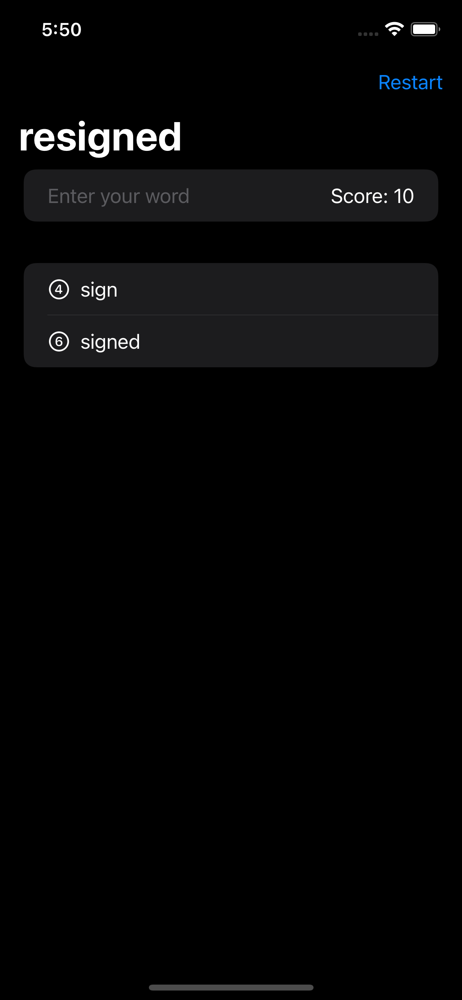
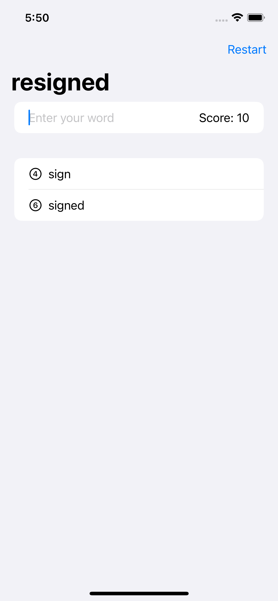

# Gün Gün SwiftUI Öğrenme Maceram - Gün 29-30-31 🚀
[Hacking With Swift - 100 days of SwiftUI](https://www.hackingwithswift.com/100/swiftui) eğitimini tamamlama maceramı aynı zamanda yazıya da döküyorum ✌️

### Objective
The game will show players a random eight-letter word, and ask them to make words out of it. For example, if the starter word is “alarming” they might spell “alarm”, “ring”, “main”, and so on.

### Challanges
- [x]  Disallow answers that are shorter than three letters or are just our start word.
- [x]  Add a toolbar button that calls `startGame()`, so users can restart with a new word whenever they want to.
- [x]  Put a text view somewhere so you can track and show the player’s score for a given root word. How you calculate score is down to you, but something involving number of words and their letter count would be reasonable.

### Dark UI Screenshots
 

### Light UI Screenshots

Bu projenin ilgili sayfalarına aşağıdaki bağlantılardan ulaşabilirsin 👇
* [30.01.2022 🏓](https://canbi.me/30-01-2022-e3f57739077d4a838371fe63a472bd8e)

**SwiftUI öğrenme maceramın tamamına göz atmak istersen görsele tıklayabilirsin**👇

