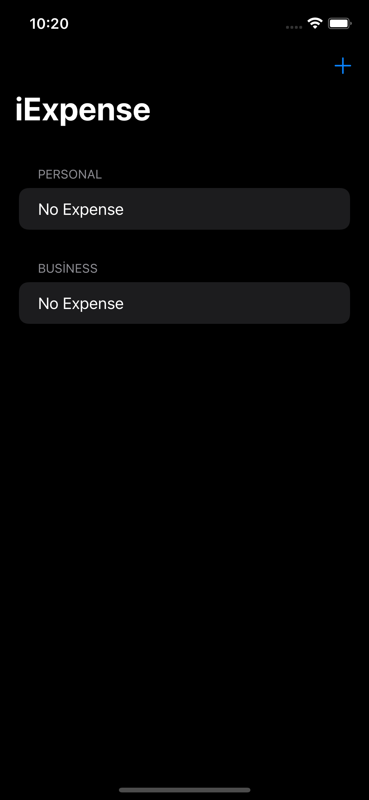
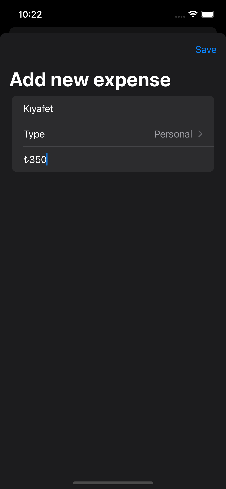
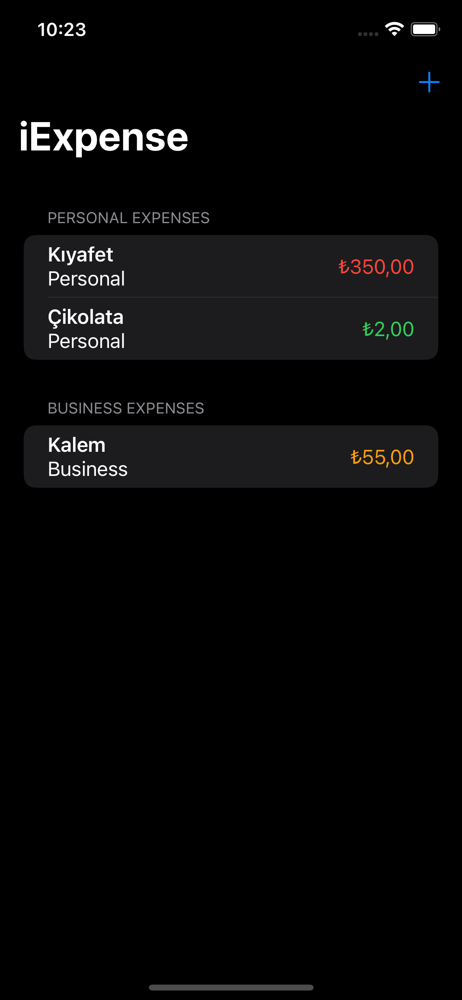
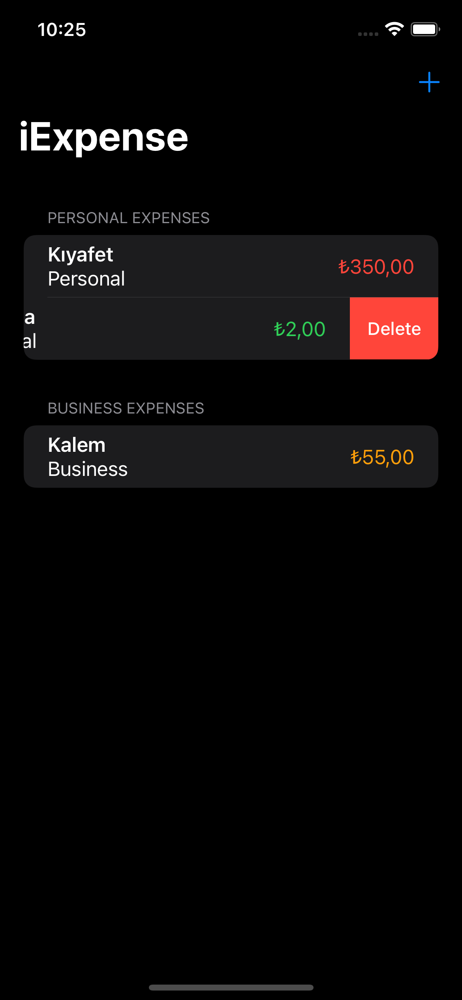
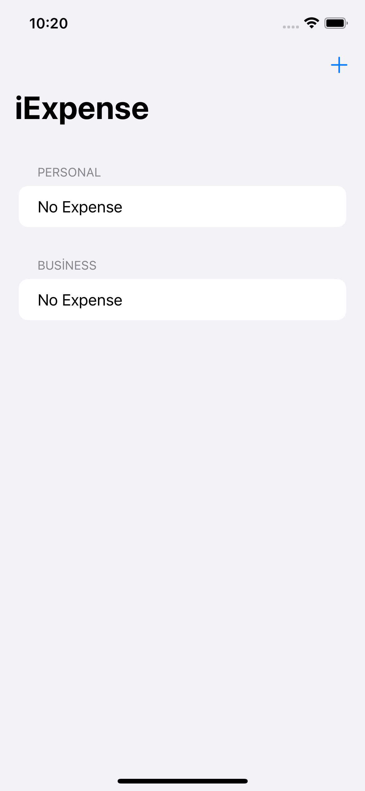
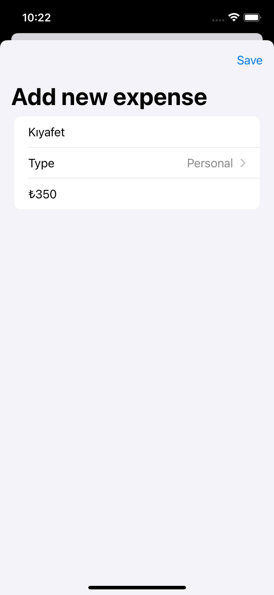
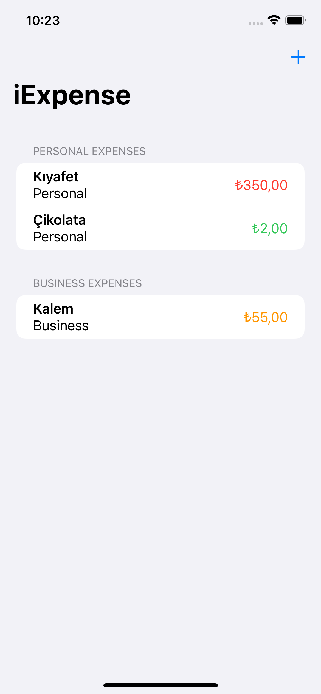
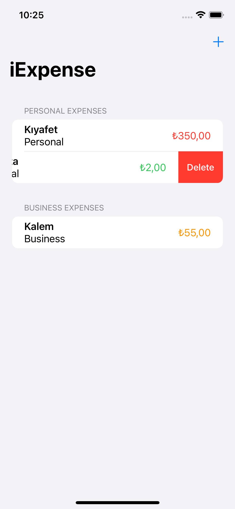

# Gün Gün SwiftUI Öğrenme Maceram - Gün 36-37-38 🚀
[Hacking With Swift - 100 days of SwiftUI](https://www.hackingwithswift.com/100/swiftui) eğitimini tamamlama maceramı aynı zamanda yazıya da döküyorum ✌️

### Objective
iExpense, which is an expense tracker that separates personal costs from business costs. At its core this is an app with a form (how much did you spend?) and a list (here are the amounts you spent)

### Challenges
- [x]  Use the user’s preferred currency, rather than always using US dollars.
- [x]  Modify the expense amounts in `ContentView` to contain some styling depending on their value – expenses under $10 should have one style, expenses under $100 another, and expenses over $100 a third style. What those styles are depend on you.
- [x]  For a bigger challenge, try splitting the expenses list into two sections: one for personal expenses, and one for business expenses. This is tricky for a few reasons, not least because it means being careful about how items are deleted!

### Project 15 Challenge
- [x]  Fix the list rows in iExpense so they read out the name and value in one single VoiceOver label, and their type in a hint.

### Dark UI Screenshots
    

### Light UI Screenshots
   

Bu projenin ilgili sayfalarına aşağıdaki bağlantılardan ulaşabilirsin 👇
* [03.02.2022 ✏️](https://canbi.me/03-02-2022-1cb9e4f77f9f4c71a7aa04bd3ba5133b)

**SwiftUI öğrenme maceramın tamamına göz atmak istersen görsele tıklayabilirsin**👇

