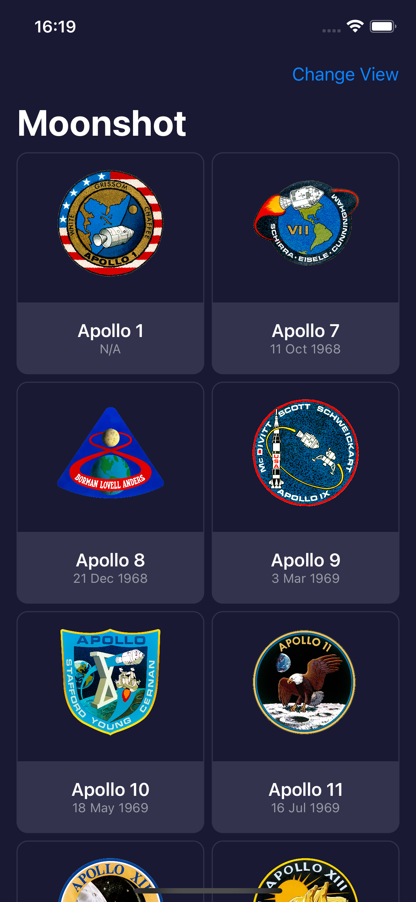
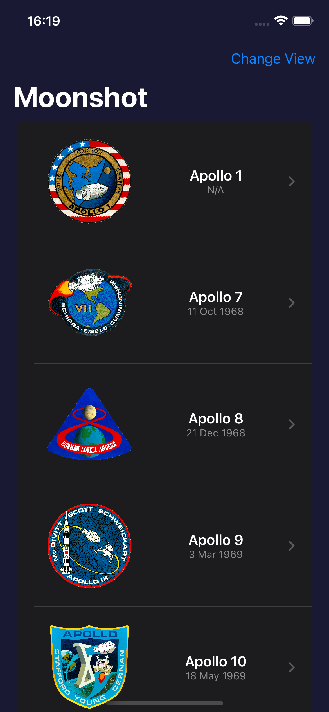
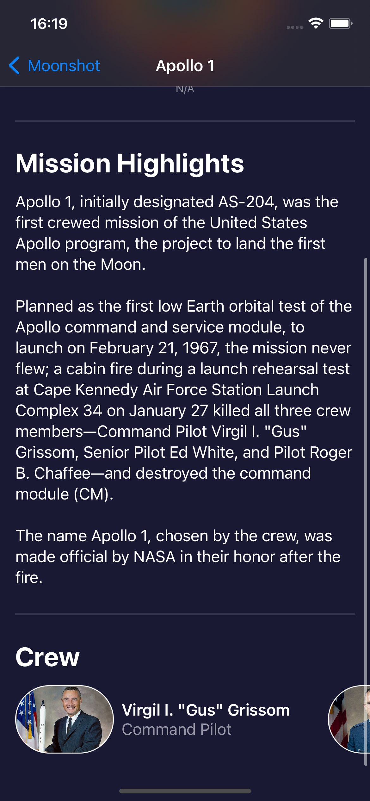
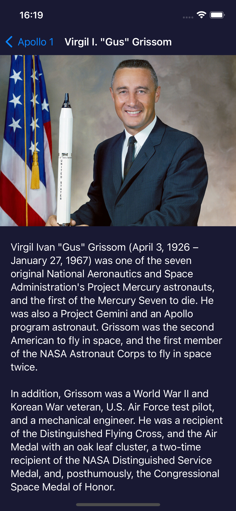

# Gün Gün SwiftUI Öğrenme Maceram - Gün 39-40-41-42 🚀
[Hacking With Swift - 100 days of SwiftUI](https://www.hackingwithswift.com/100/swiftui) eğitimini tamamlama maceramı aynı zamanda yazıya da döküyorum ✌️

### Objective
An app that lets users learn about the missions and astronauts that formed NASA’s Apollo space program

### Challanges
- [x]  Add the launch date to `MissionView`, below the mission badge. You might choose to format this differently given that more space is available, but it’s down to you.
- [x]  Extract one or two pieces of view code into their own new SwiftUI views – the horizontal scroll view in `MissionView` is a great candidate, but if you followed my styling then you could also move the `Rectangle` dividers out too.
- [x]  For a tough challenge, add a toolbar item to `ContentView` that toggles between showing missions as a grid and as a list.

### Dark UI Screenshots
     

Bu projenin ilgili sayfalarına aşağıdaki bağlantılardan ulaşabilirsin 👇
* [03.02.2022 ✏️](https://canbi.me/03-02-2022-1cb9e4f77f9f4c71a7aa04bd3ba5133b)

**SwiftUI öğrenme maceramın tamamına göz atmak istersen görsele tıklayabilirsin**👇

