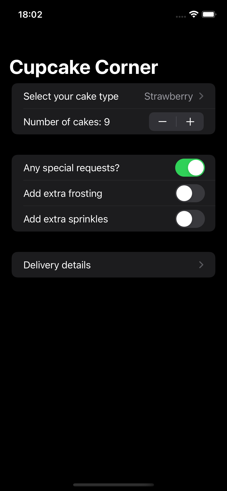
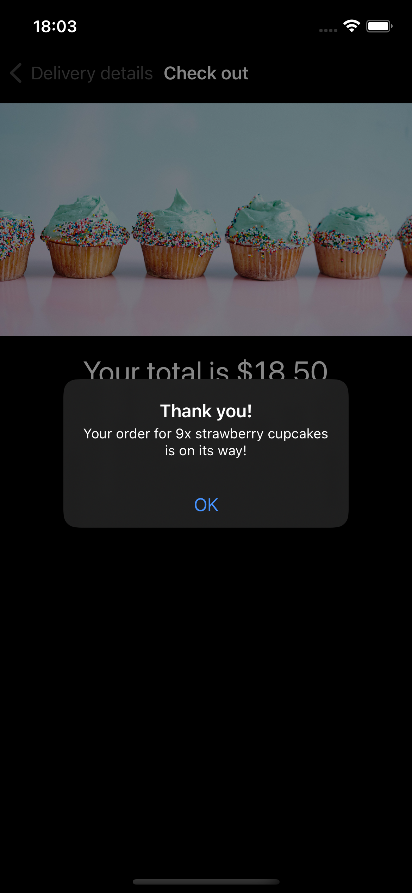
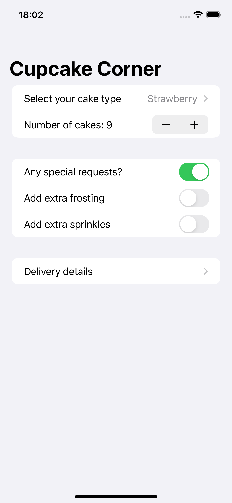
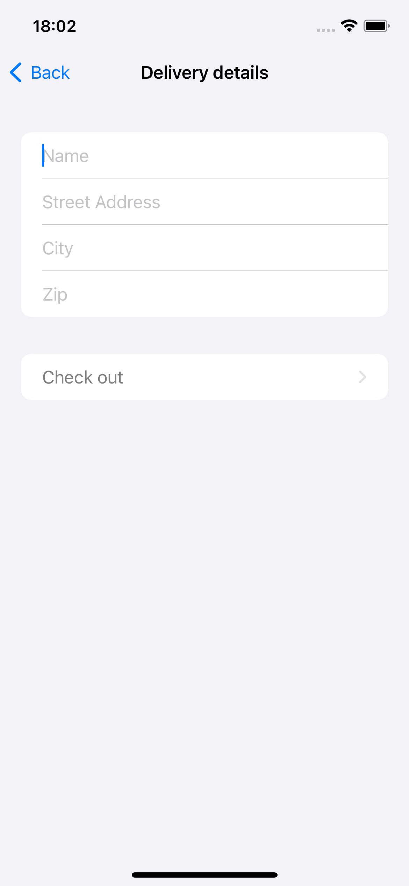
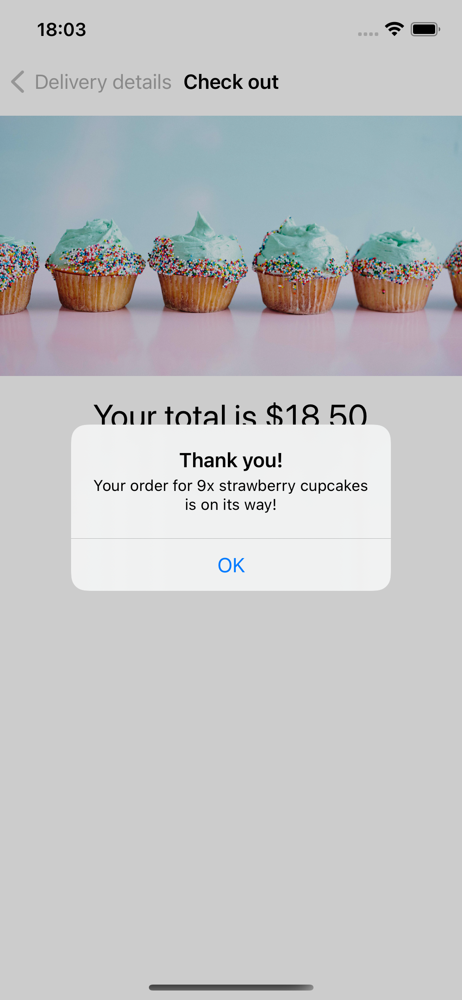

# Gün Gün SwiftUI Öğrenme Maceram - Gün 49-50-51-52 🚀
[Hacking With Swift - 100 days of SwiftUI](https://www.hackingwithswift.com/100/swiftui) eğitimini tamamlama maceramı aynı zamanda yazıya da döküyorum ✌️

### Objective
A multi-screen app for ordering cupcakes

### Challanges
- [x]  Our address fields are currently considered valid if they contain anything, even if it’s just only whitespace. Improve the validation to make sure a string of pure whitespace is invalid.
- [x]  If our call to `placeOrder()` fails – for example if there is no internet connection – show an informative alert for the user. To test this, try commenting out the `request.httpMethod = "POST"` line in your code, which should force the request to fail.
- [ ]  For a more challenging task, see if you can convert our data model from a class to a struct, then create an `ObservableObject` class wrapper around it that gets passed around. This will result in your class having one `@Published` property, which is the data struct inside it, and should make supporting `Codable` on the struct much easier.

### Dark UI Screenshots
   

### Light UI Screenshots
   

Bu projenin ilgili sayfalarına aşağıdaki bağlantılardan ulaşabilirsin 👇
* [07.02.2022 🎁](https://canbi.me/07-02-2022-f4be7c946f6949a7af12b8f9c0e0496c)

**SwiftUI öğrenme maceramın tamamına göz atmak istersen görsele tıklayabilirsin**👇

