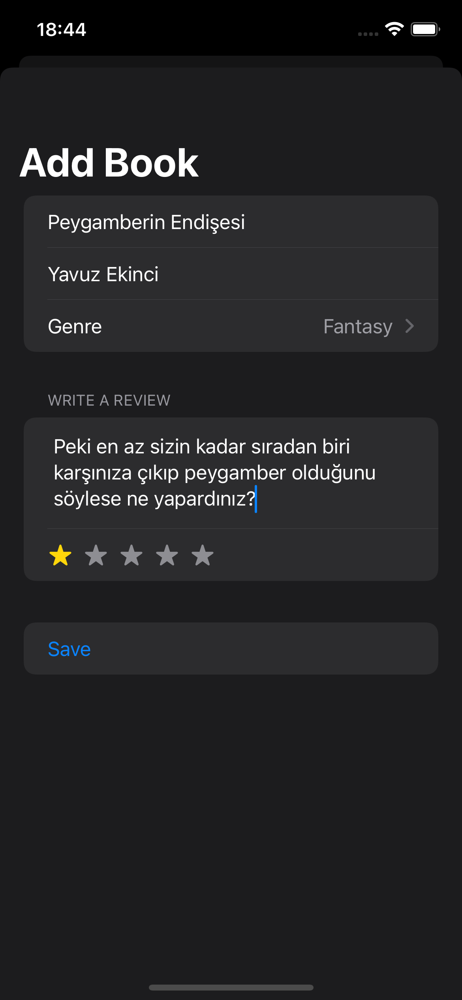
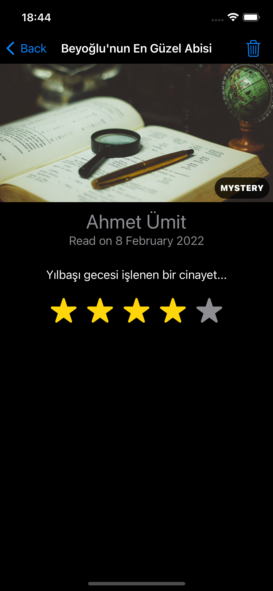
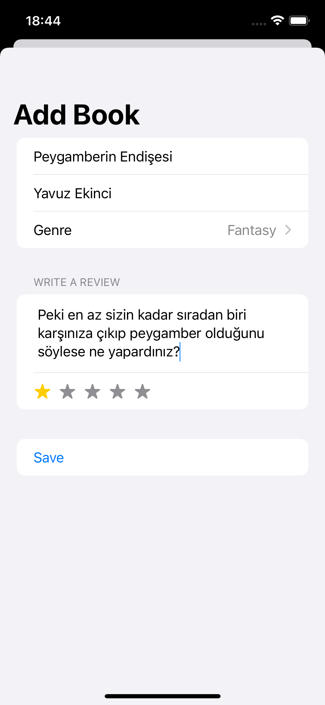
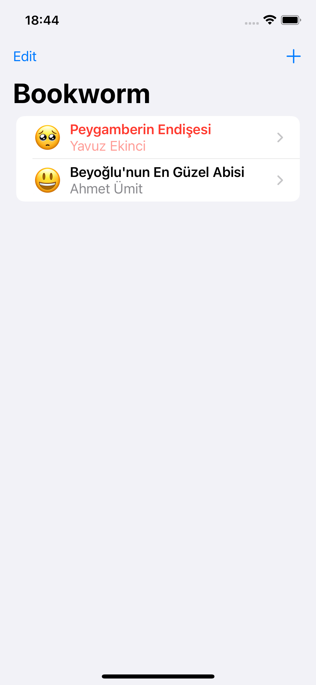
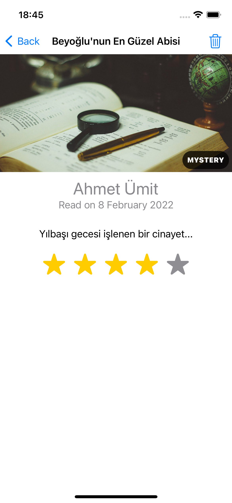

# Gün Gün SwiftUI Öğrenme Maceram - Gün 53-54-55-56 🚀
[Hacking With Swift - 100 days of SwiftUI](https://www.hackingwithswift.com/100/swiftui) eğitimini tamamlama maceramı aynı zamanda yazıya da döküyorum ✌️

### Objective
An app to track which books you’ve read and what you thought of them.

### Challanges
- [x]  Right now it’s possible to select no title, author, or genre for books, which causes a problem for the detail view. Please fix this, either by forcing defaults, validating the form, or showing a default picture for unknown genres – you can choose.
- [x]  Modify `ContentView` so that books rated as 1 star are highlighted somehow, such as having their name shown in red.
- [x]  Add a new “date” attribute to the Book entity, assigning `Date.now` to it so it gets the current date and time, then format that nicely somewhere in `DetailView`.

### Dark UI Screenshots
  

### Light UI Screenshots
  

Bu projenin ilgili sayfalarına aşağıdaki bağlantılardan ulaşabilirsin 👇
* [07.02.2022 🎁](https://canbi.me/07-02-2022-f4be7c946f6949a7af12b8f9c0e0496c)
* [08.02.2022 🧛🏻](https://canbi.me/08-02-2022-510a1e3f2ef045b18a49bbe6ebaf306b)

**SwiftUI öğrenme maceramın tamamına göz atmak istersen görsele tıklayabilirsin**👇

