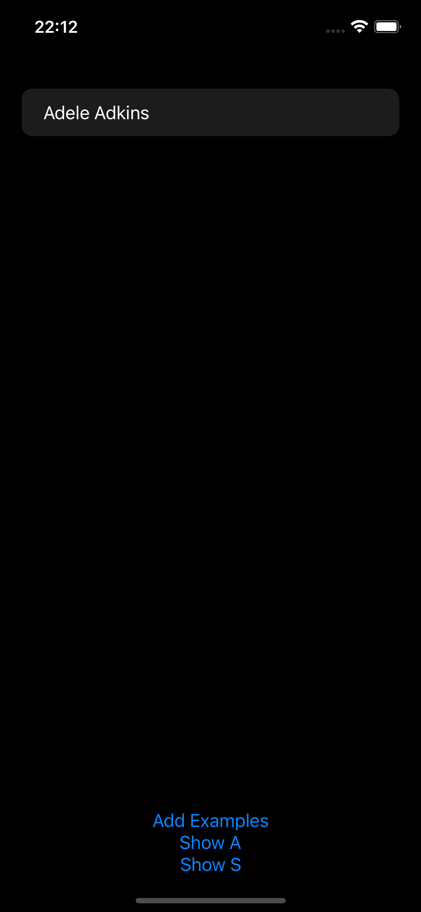
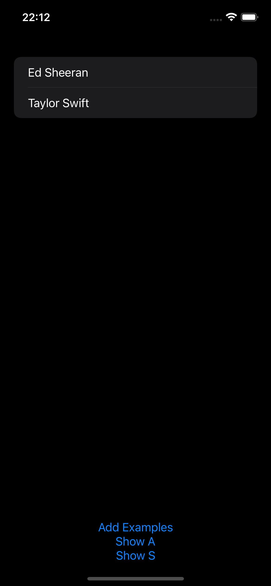
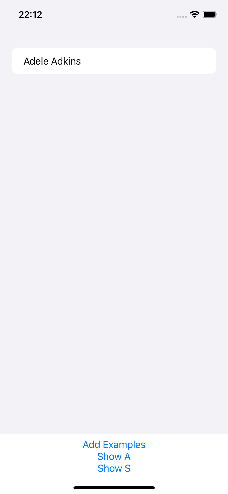
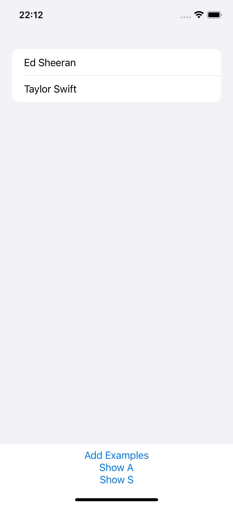

# Gün Gün SwiftUI Öğrenme Maceram - Gün 57-58-59 🚀
[Hacking With Swift - 100 days of SwiftUI](https://www.hackingwithswift.com/100/swiftui) eğitimini tamamlama maceramı aynı zamanda yazıya da döküyorum ✌️

### Objective
This technique project is going to explore Core Data in more detail, starting with a summary of some basic techniques then building up to tackling some more complex problems.

### Challanges
- [x]  Make it accept a string parameter that controls which predicate is applied. You can use Swift’s string interpolation to place this in the predicate.
- [x]  Modify the predicate string parameter to be an enum such as `.beginsWith`, then make that enum get resolved to a string inside the initializer.
- [x]  Make `FilteredList` accept an array of `SortDescriptor` objects to get used in its fetch request.

### Dark UI Screenshots
  

### Light UI Screenshots
  

Bu projenin ilgili sayfalarına aşağıdaki bağlantılardan ulaşabilirsin 👇
* [08.02.2022 🧛🏻](https://canbi.me/08-02-2022-510a1e3f2ef045b18a49bbe6ebaf306b)

**SwiftUI öğrenme maceramın tamamına göz atmak istersen görsele tıklayabilirsin**👇

