# Gün Gün SwiftUI Öğrenme Maceram - Gün 62-67 🚀
[Hacking With Swift - 100 days of SwiftUI](https://www.hackingwithswift.com/100/swiftui) eğitimini tamamlama maceramı aynı zamanda yazıya da döküyorum ✌️

### Objective
An app that lets the user import photos from their library, then modify them using various image effects.

### Challanges
- [ ]  Try making the Save button disabled if there is no image in the image view.
- [ ]  Experiment with having more than one slider, to control each of the input keys you care about. For example, you might have one for radius and one for intensity.
- [ ]  Explore the range of available Core Image filters, and add any three of your choosing to the app.

### Dark UI Screenshots
 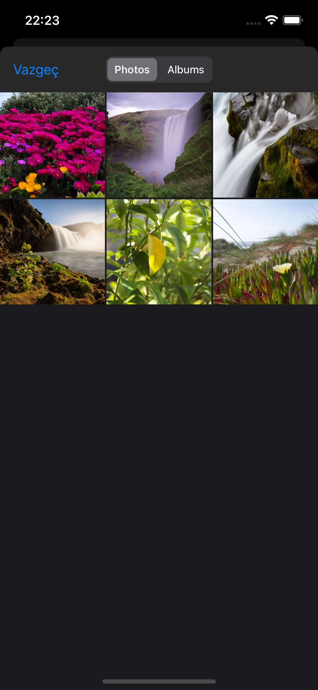 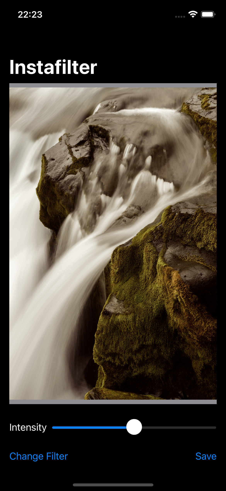 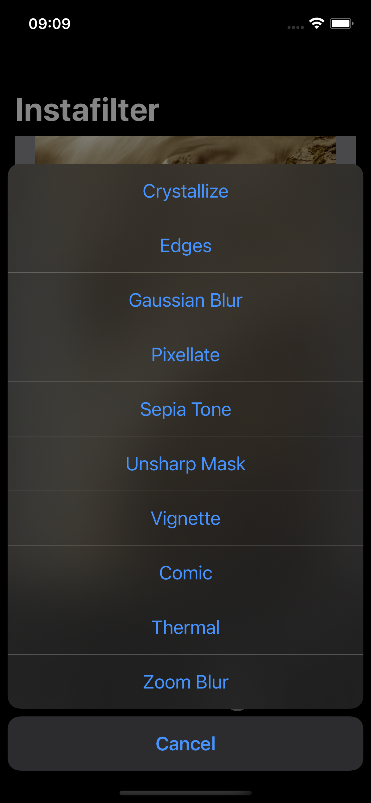 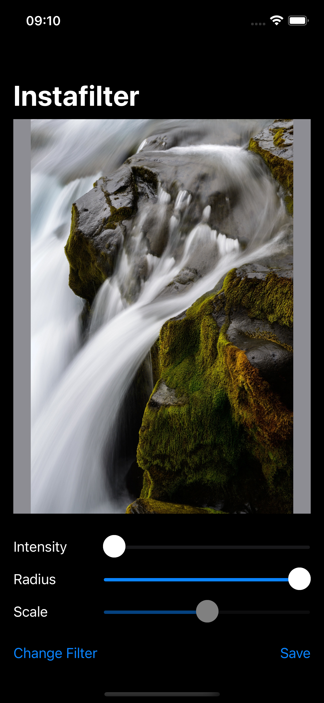 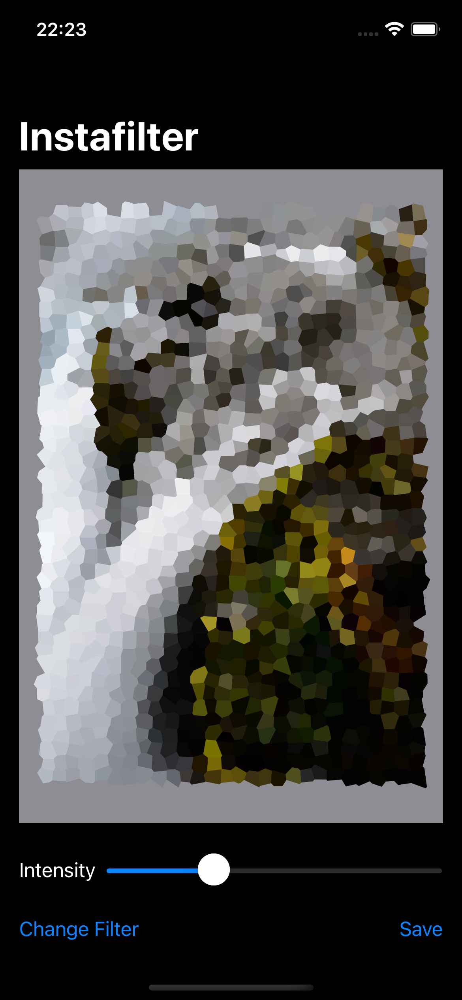 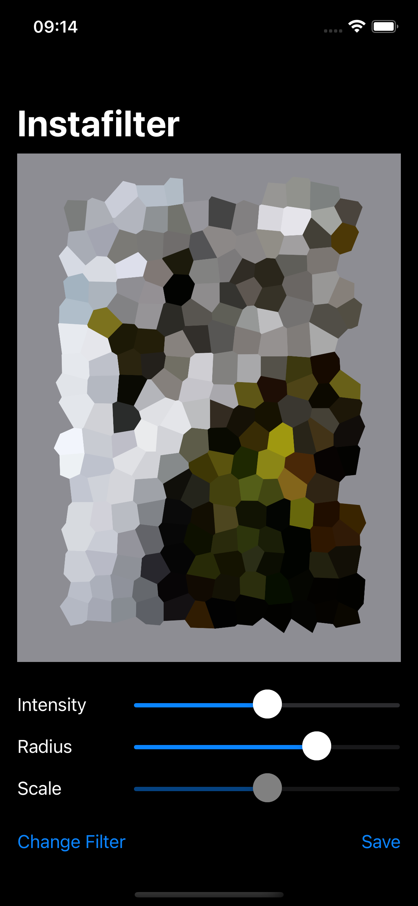

### Light UI Screenshots
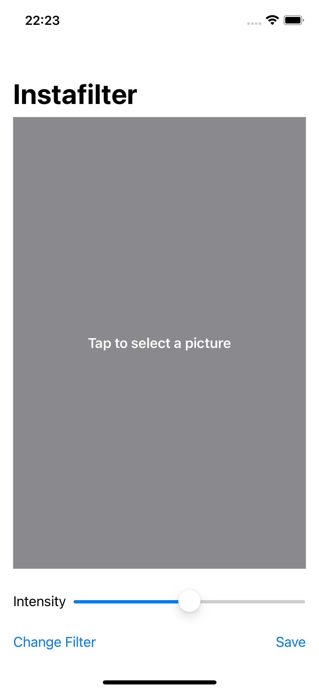  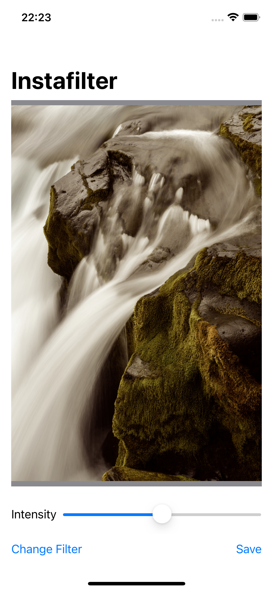  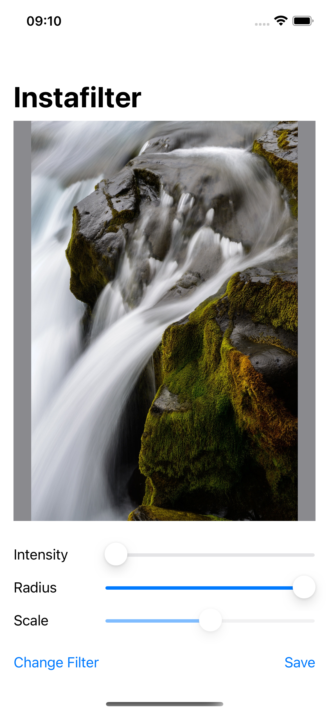 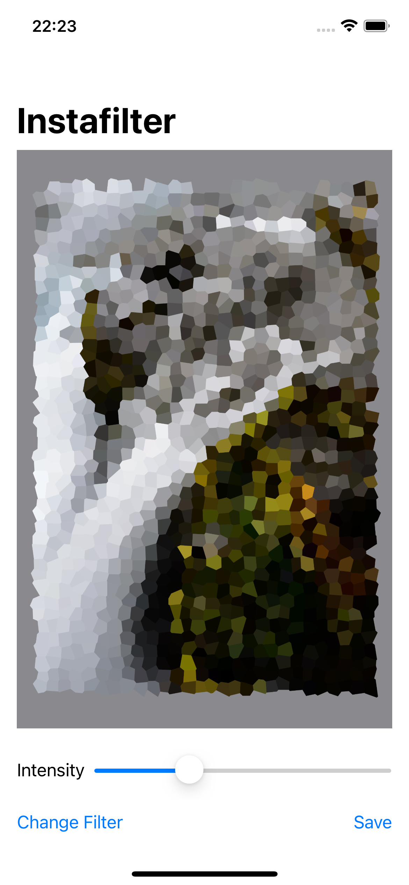 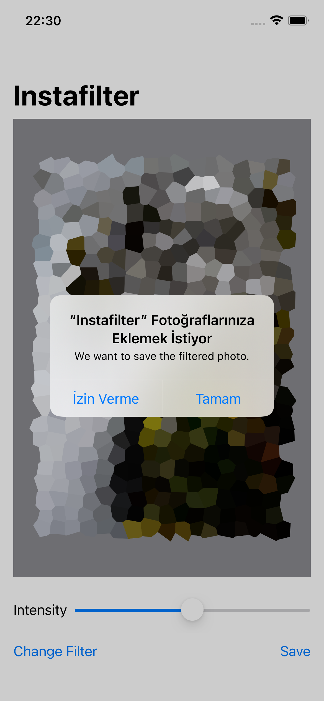 

Bu projenin ilgili sayfalarına aşağıdaki bağlantılardan ulaşabilirsin 👇
* [11.02.2022 🛹](https://canbi.me/11-02-2022-bb406065ca0a46e29ecf1f77c9866245)

**SwiftUI öğrenme maceramın tamamına göz atmak istersen görsele tıklayabilirsin**👇

