# Gün Gün SwiftUI Öğrenme Maceram - Gün 68-73 🚀
[Hacking With Swift - 100 days of SwiftUI](https://www.hackingwithswift.com/100/swiftui) eğitimini tamamlama maceramı aynı zamanda yazıya da döküyorum ✌️

### Objective
An app that lets the user build a private list of places on the map that they intend to visit one day, add a description for that place, look up interesting places that are nearby, and save it all to the iOS storage for later. 

### Challanges
- [x]  Our + button is rather hard to tap. Try moving all its modifiers to the image inside the button – what difference does it make, and can you think why?
- [ ]  Our app silently fails when errors occur during biometric authentication, so add code to show those errors in an alert.
- [x]  Create another view model, this time for `EditView`. What you put in the view model is down to you, but I would recommend leaving `dismiss` and `onSave` in the view itself – the former uses the environment, which can only be read by the view, and the latter doesn’t really add anything when moved into the model.

### Dark UI Screenshots
 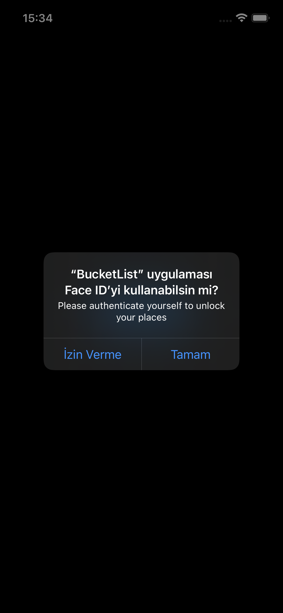 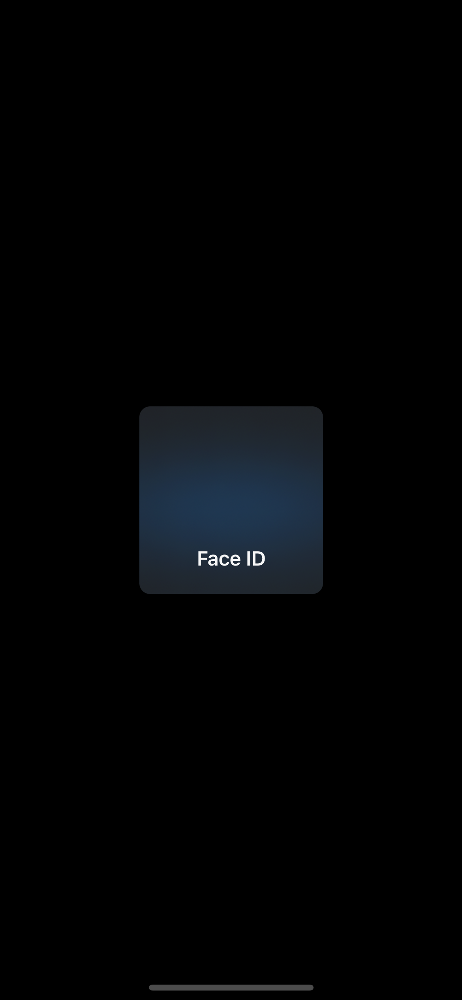 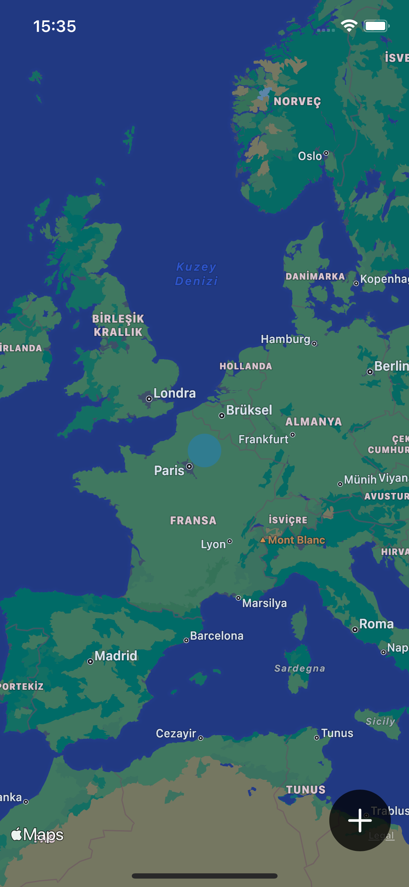 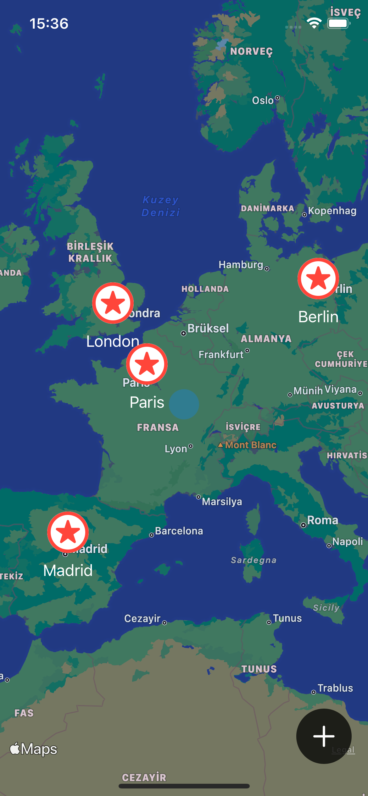 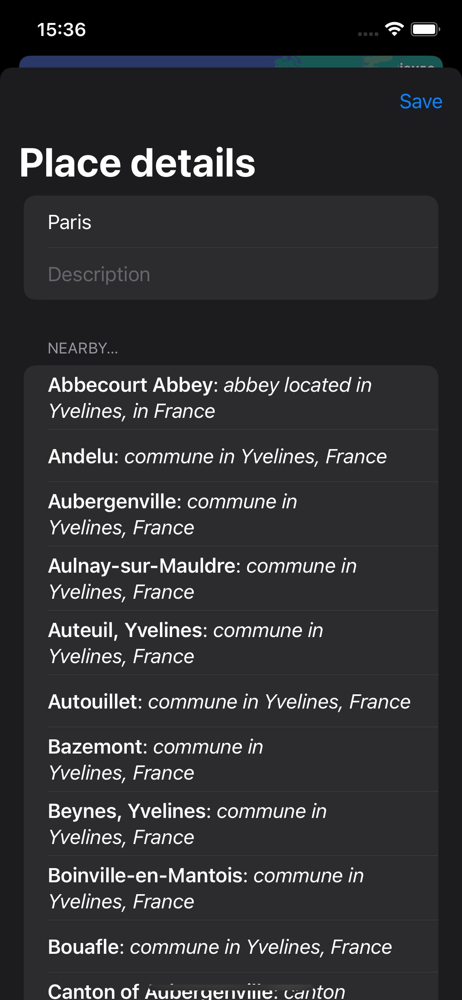

### Light UI Screenshots
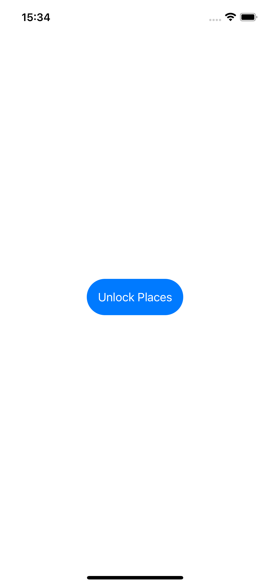 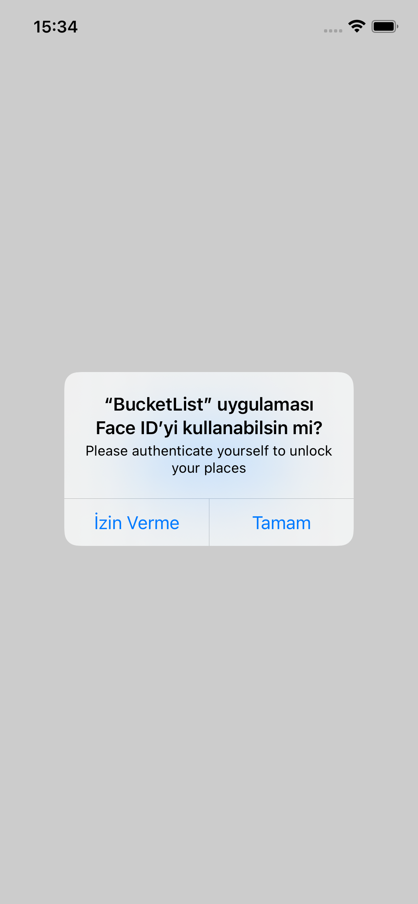 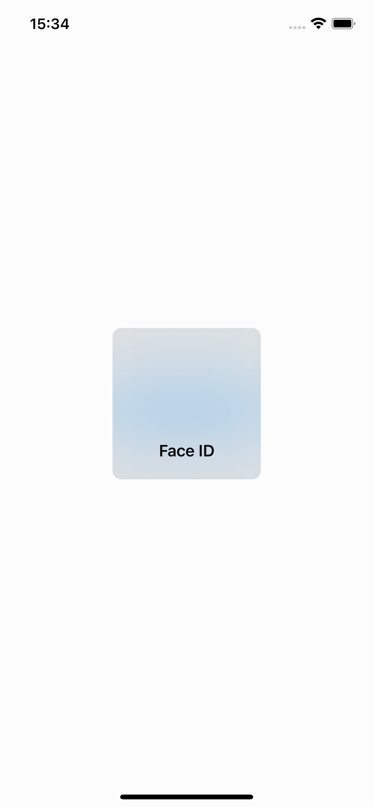 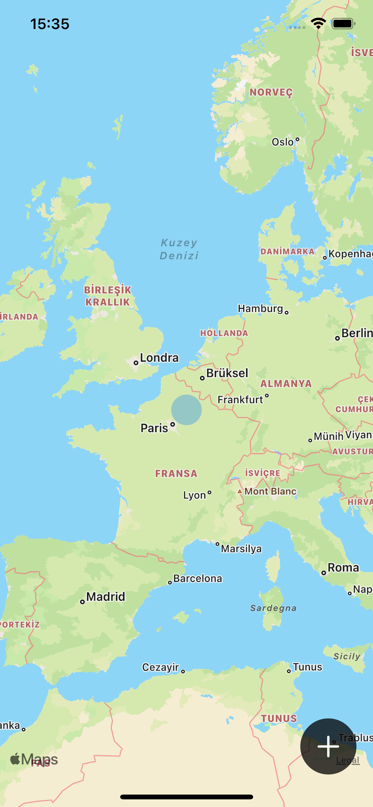 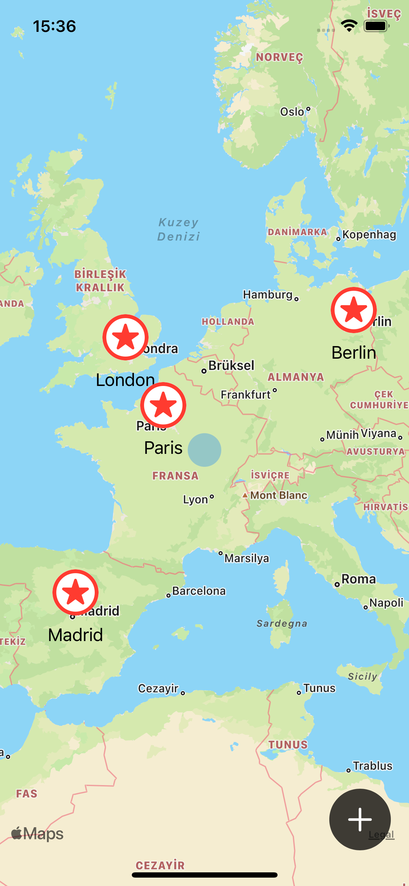 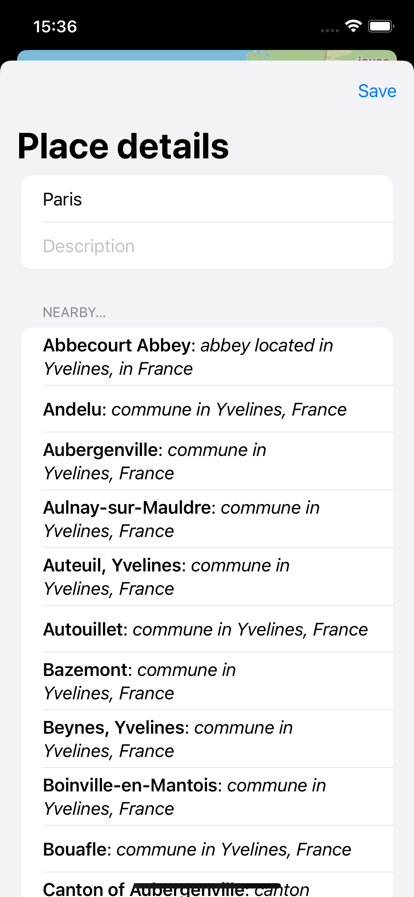

Bu projenin ilgili sayfalarına aşağıdaki bağlantılardan ulaşabilirsin 👇
* [12.02.2022 🎈](https://canbi.me/12-02-2022-d786d4c7cc9a4e5588e046c49def0fa5)

**SwiftUI öğrenme maceramın tamamına göz atmak istersen görsele tıklayabilirsin**👇

