# Gün Gün SwiftUI Öğrenme Maceram - Gün 68-73 🚀
[Hacking With Swift - 100 days of SwiftUI](https://www.hackingwithswift.com/100/swiftui) eğitimini tamamlama maceramı aynı zamanda yazıya da döküyorum ✌️

### Objective
An app to track who you meet at conferences. You’ve probably seen apps like it before: it will show a QR code that stores your attendee information, then others can scan that code to add you to their list of possible leads for later follow up.

### Challenges
- [x]  Add an icon to the “Everyone” screen showing whether a prospect was contacted or not.
- [x]  Use JSON and the documents directory for saving and loading our user data.
- [x]  Use a confirmation dialog to customize the way users are sorted in each tab – by name or by most recent.

### Dark UI Screenshots
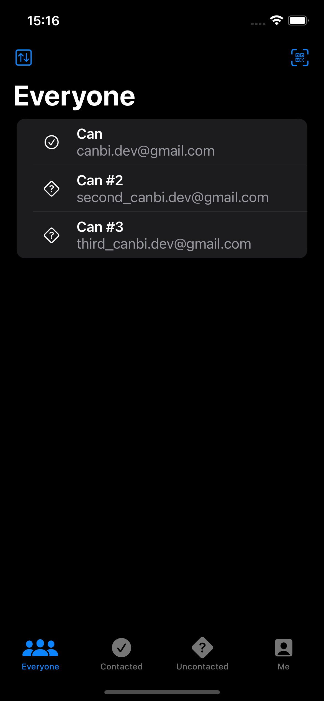 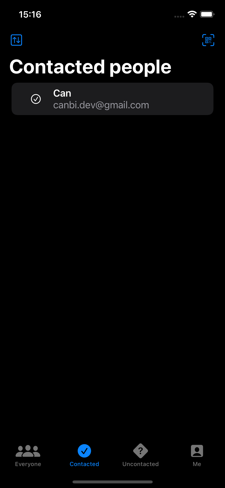 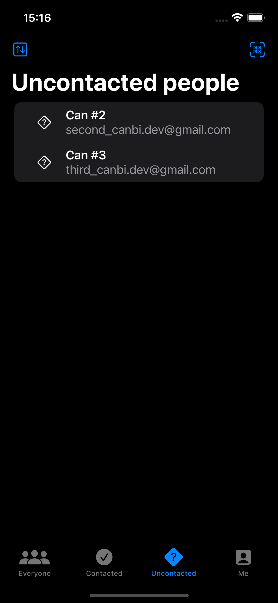 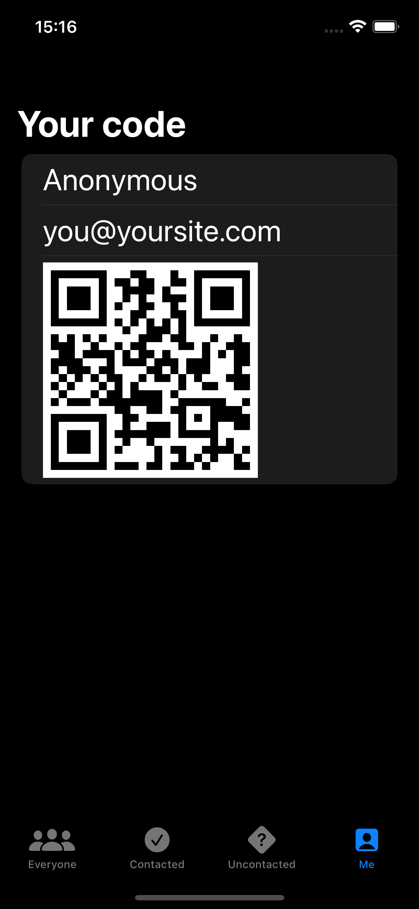 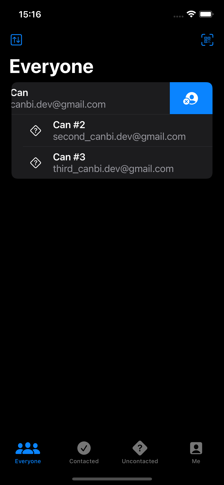 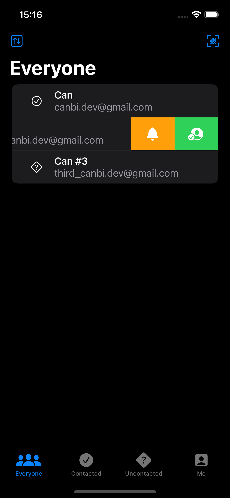  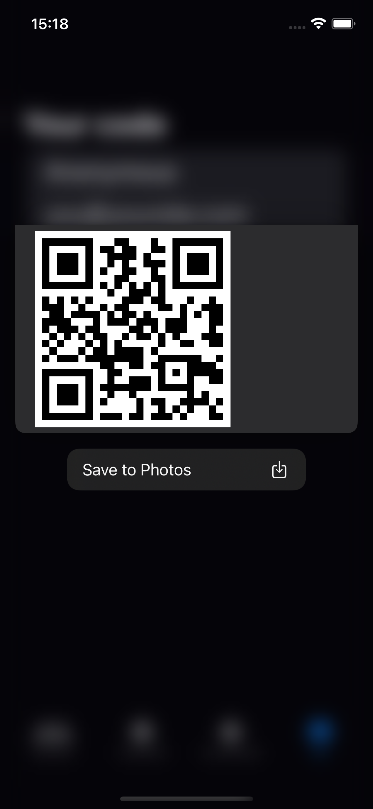 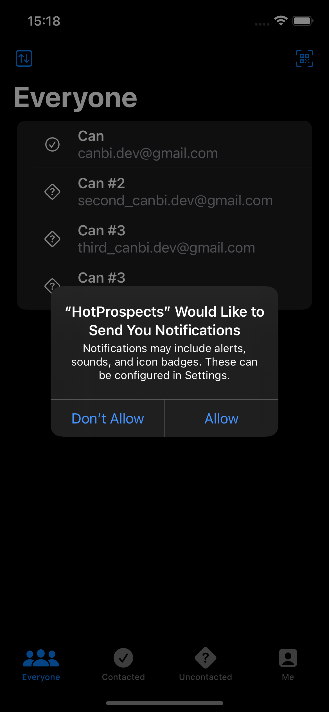 

### Light UI Screenshots
 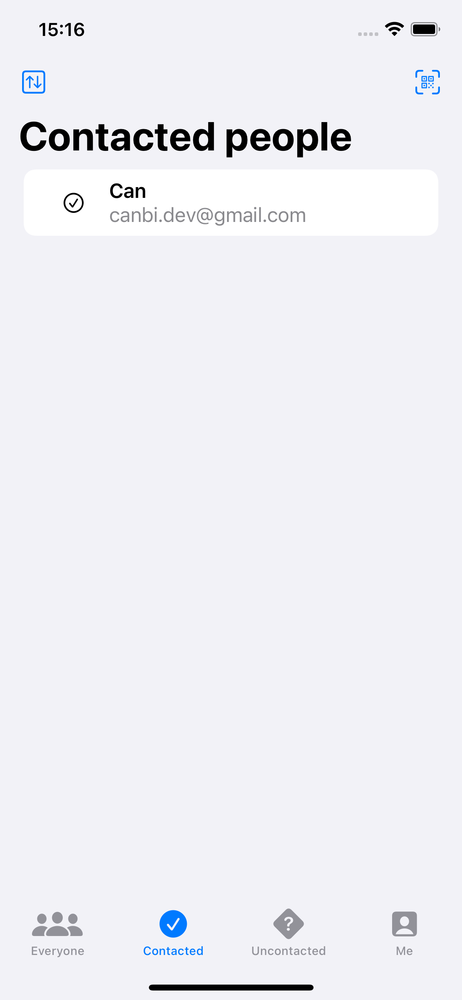 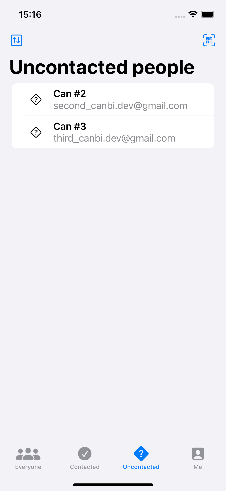 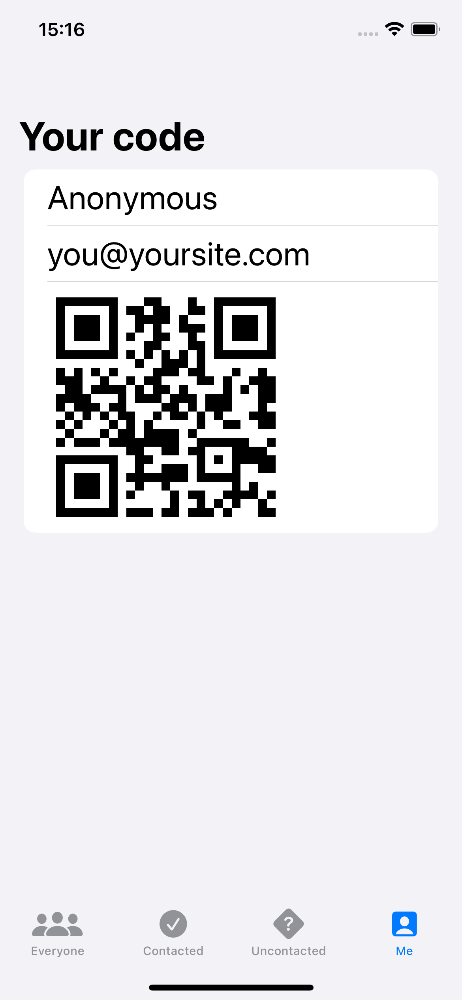 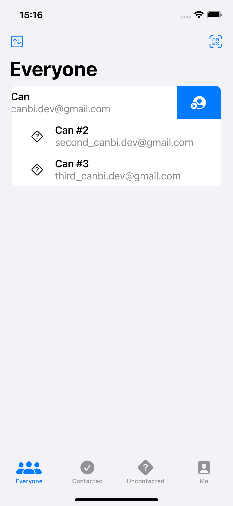 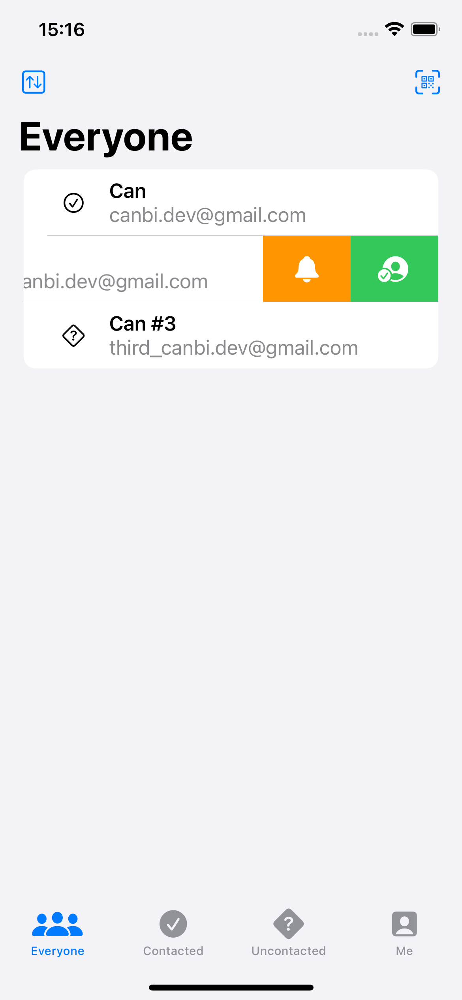 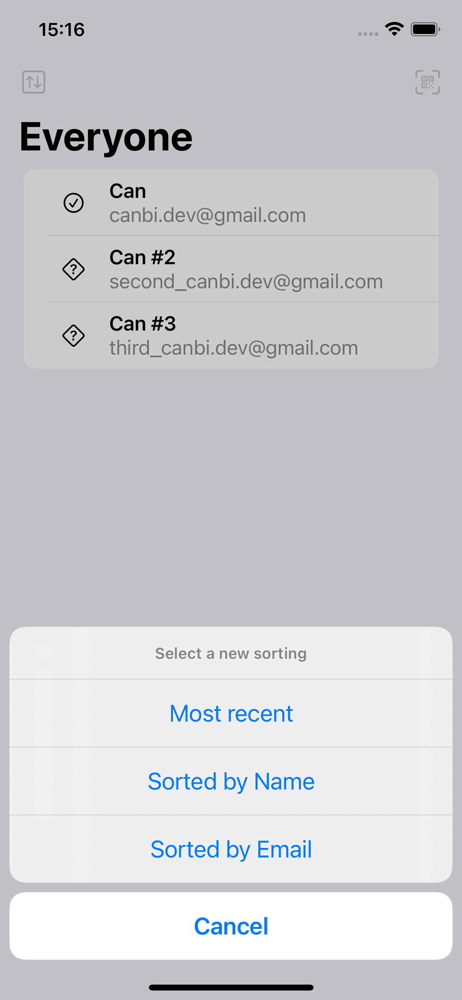 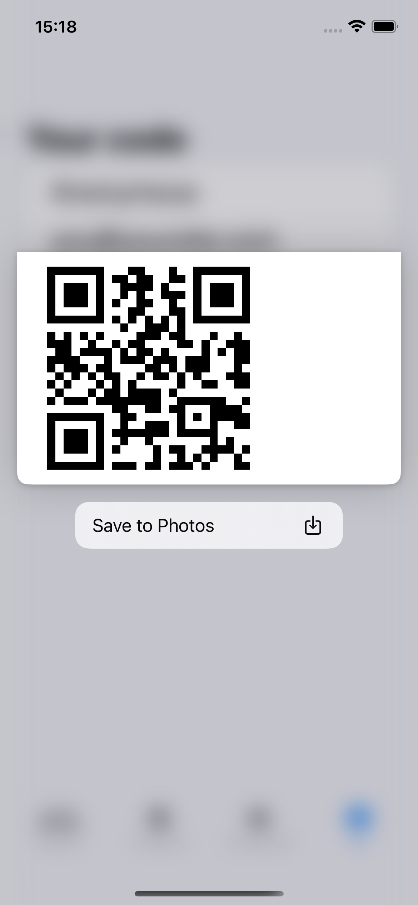  

Bu projenin ilgili sayfalarına aşağıdaki bağlantılardan ulaşabilirsin 👇
* [19.02.2022 ☕](https://canbi.me/19-02-2022-5c93537a93ab4ac0b0cb28cc0958cbf2)

**SwiftUI öğrenme maceramın tamamına göz atmak istersen görsele tıklayabilirsin**👇

