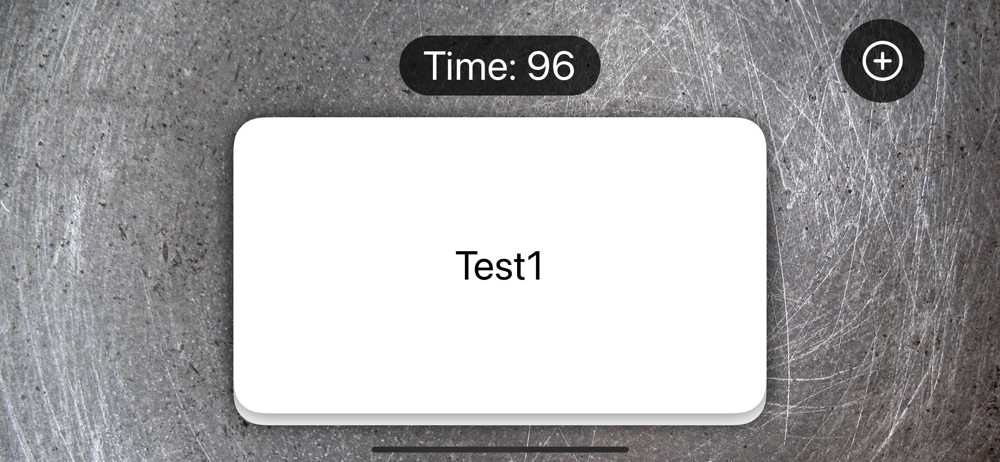
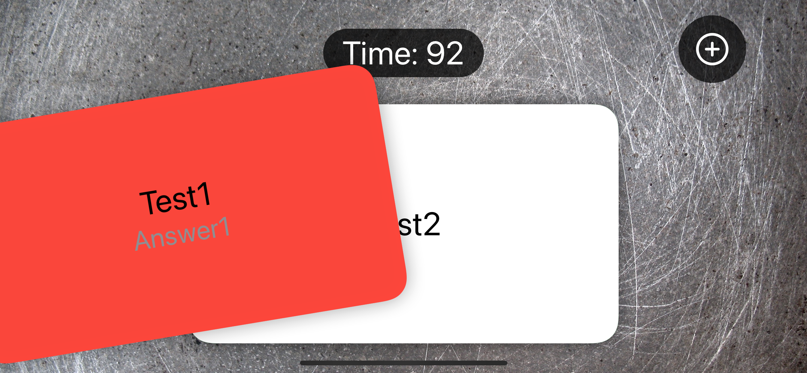
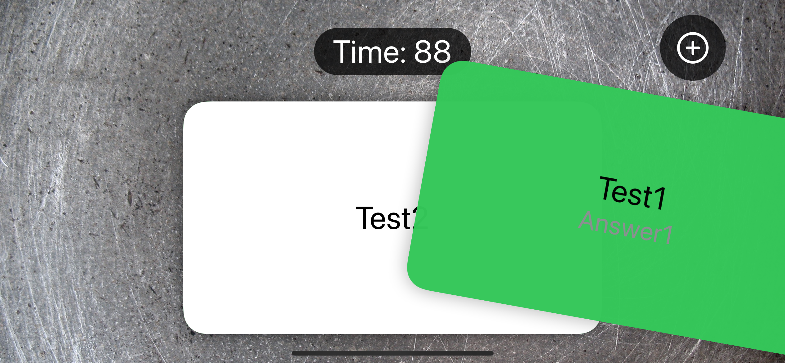
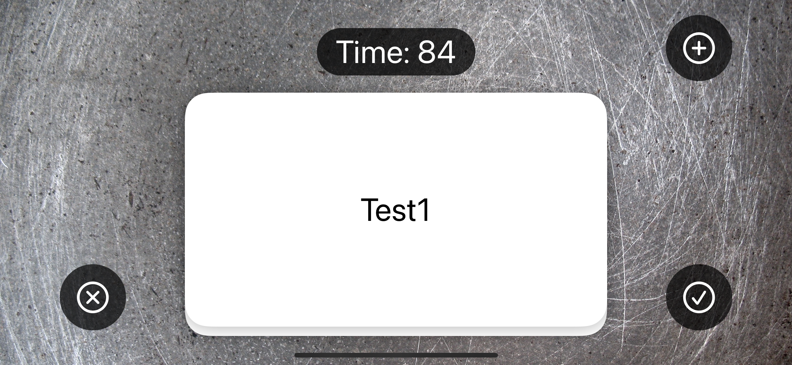
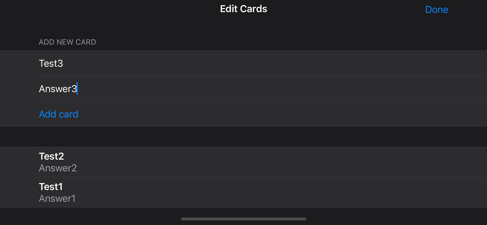
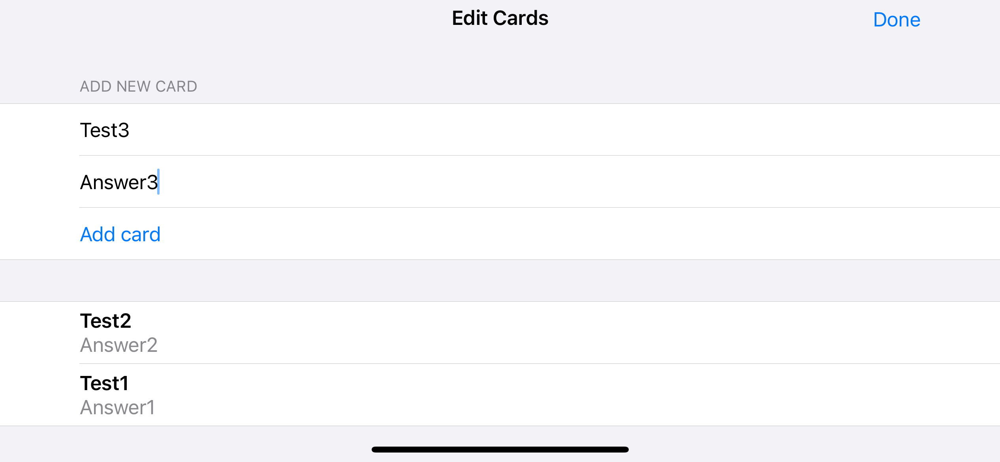

# Gün Gün SwiftUI Öğrenme Maceram - Gün 68-73 🚀
[Hacking With Swift - 100 days of SwiftUI](https://www.hackingwithswift.com/100/swiftui) eğitimini tamamlama maceramı aynı zamanda yazıya da döküyorum ✌️

### Objective
An app that helps users learn things using flashcards – cards with one thing written on such as “to buy”, and another thing written on the other side, such as “comprar”. Of course, this is a digital app so we don’t need to worry about “the other side”, and can instead just make the detail for the flash card appear when it’s tapped.

### Challenges
- [x]  When adding a card, the textfields keep their current text – fix that so that the textfields clear themselves after a card is added.
- [x]  If you drag a card to the right but not far enough to remove it, then release, you see it turn red as it slides back to the center. Why does this happen and how can you fix it? (Tip: think about the way we set `offset` back to 0 immediately, even though the card hasn’t animated yet. You might solve this with a ternary within a ternary, but a custom modifier will be cleaner.)
- [x]  For a harder challenge: when the users gets an answer wrong, add that card goes back into the array so the user can try it again. Doing this successfully means rethinking the `ForEach` loop, because relying on simple integers isn’t enough – your cards need to be uniquely identifiable.

Still thirsty for more? Try upgrading our loading and saving code in two ways:

- [x]  Make it use documents JSON rather than `UserDefaults` – this is generally a good idea, so you should get practice with this.
- [ ]  Try to find a way to centralize the loading and saving code for the cards. You might need to experiment a little to find something you like!

### Dark UI Screenshots
       

### Light UI Screenshots
       

Bu projenin ilgili sayfalarına aşağıdaki bağlantılardan ulaşabilirsin 👇
* [20.02.2022 💣](https://canbi.me/20-02-2022-3e6848cf1eb14d3f8be741e7562aa83f)

**SwiftUI öğrenme maceramın tamamına göz atmak istersen görsele tıklayabilirsin**👇

