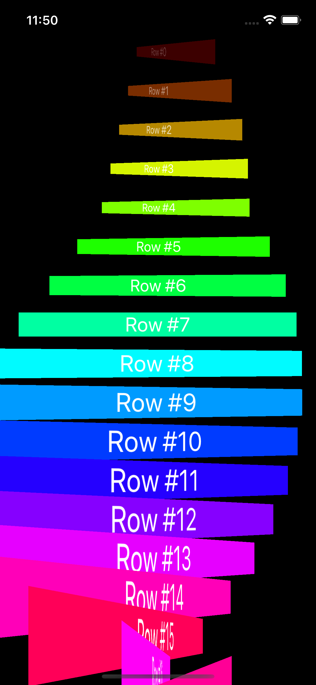
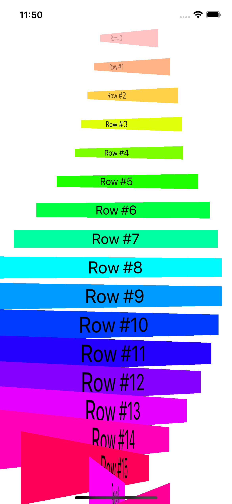

# Gün Gün SwiftUI Öğrenme Maceram - Gün 92-94 🚀
[Hacking With Swift - 100 days of SwiftUI](https://www.hackingwithswift.com/100/swiftui) eğitimini tamamlama maceramı aynı zamanda yazıya da döküyorum ✌️

### Objective
Building special effects using GeometryReader

### Challenges
- [x]  Make views near the top of the scroll view fade out to 0 opacity – I would suggest starting at about 200 points from the top.
- [x]  Make views adjust their scale depending on their vertical position, with views near the bottom being large and views near the top being small. I would suggest going no smaller than 50% of the regular size.
- [x]  For a real challenge make the views change color as you scroll. For the best effect, you should create colors using the `Color(hue:saturation:brightness:)` initializer, feeding in varying values for the hue.

### Dark UI Screenshots
 

### Light UI Screenshots
 

Bu projenin ilgili sayfalarına aşağıdaki bağlantılardan ulaşabilirsin 👇
* [21.02.2022 ⛺](https://canbi.me/21-02-2022-7f18f079387e483f920add7ba6b026e2)

**SwiftUI öğrenme maceramın tamamına göz atmak istersen görsele tıklayabilirsin**👇

