# Gün Gün SwiftUI Öğrenme Maceram - Gün 96-99 🚀
[Hacking With Swift - 100 days of SwiftUI](https://www.hackingwithswift.com/100/swiftui) eğitimini tamamlama maceramı aynı zamanda yazıya da döküyorum ✌️

### Objective
An app to let users browse ski resorts around the world, to help them find one suitable for their next holiday.

### Challenges
- [x]  Add a photo credit over the `ResortView` image. The data is already loaded from the JSON for this purpose, so you just need to make it look good in the UI.
- [x]  Fill in the loading and saving methods for `Favorites`.
- [x]  For a real challenge, let the user sort the resorts in `ContentView` either using the default order, alphabetical order, or country order.

### Dark UI Screenshots
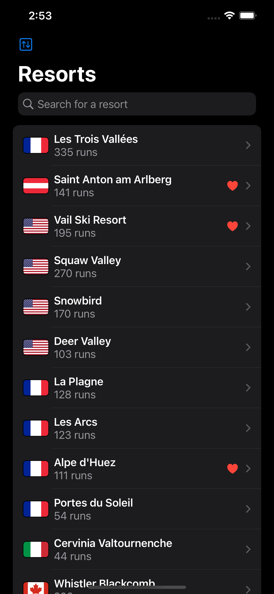 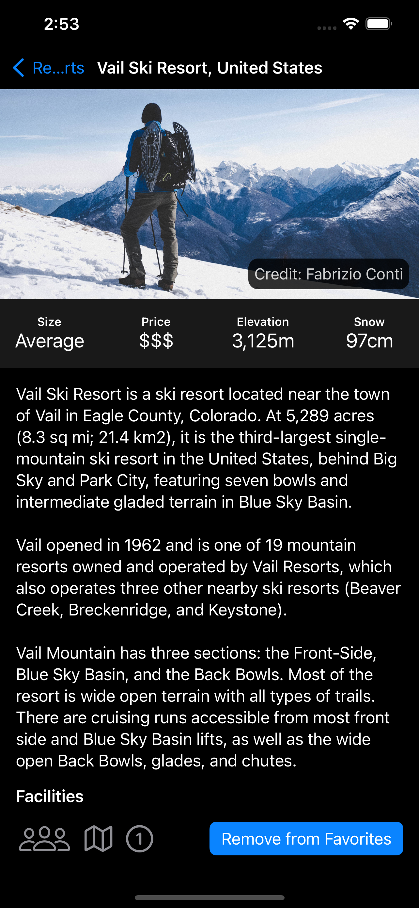 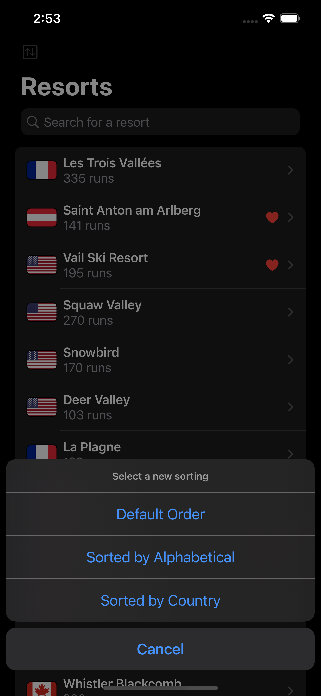 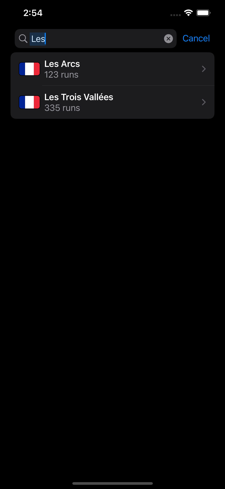 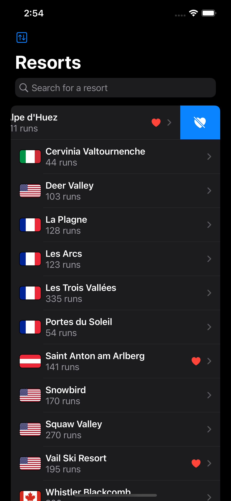 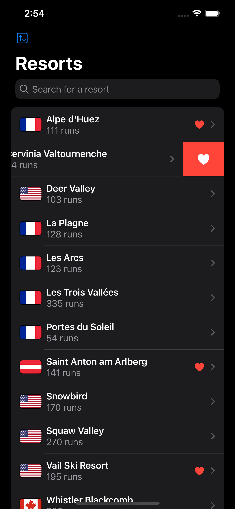  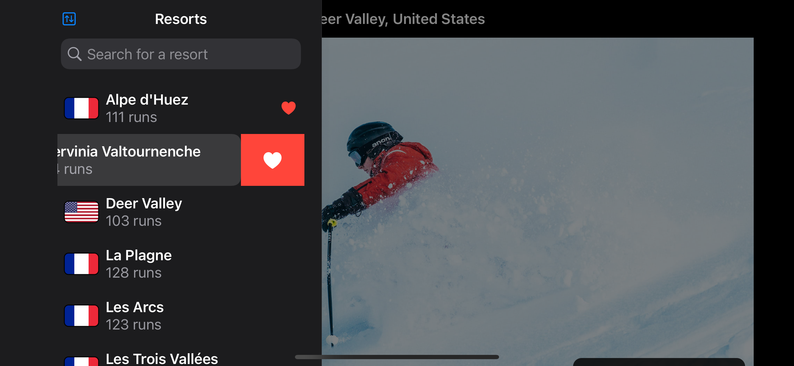 

### Light UI Screenshots
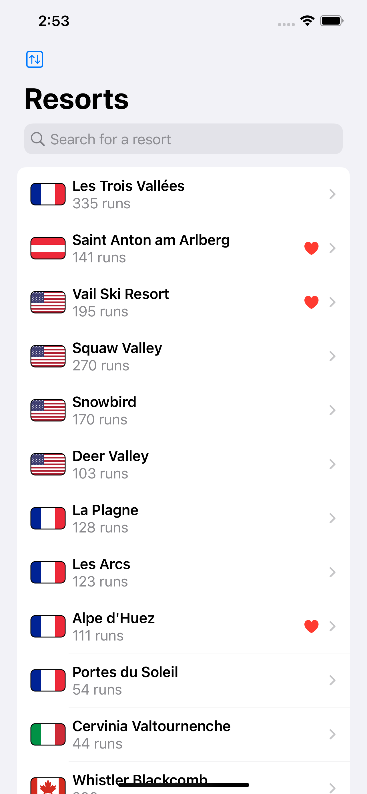 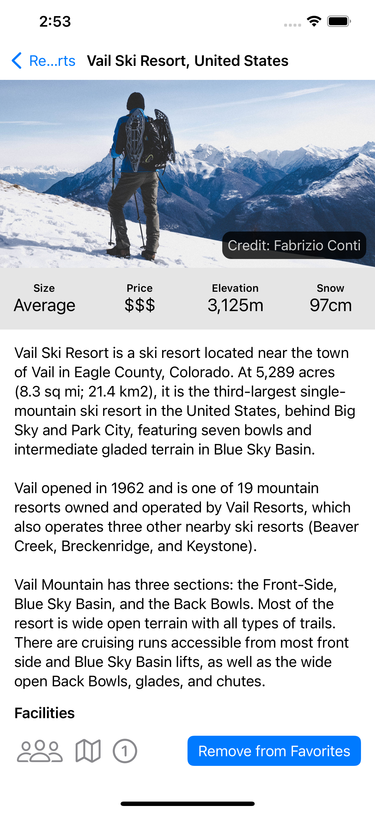 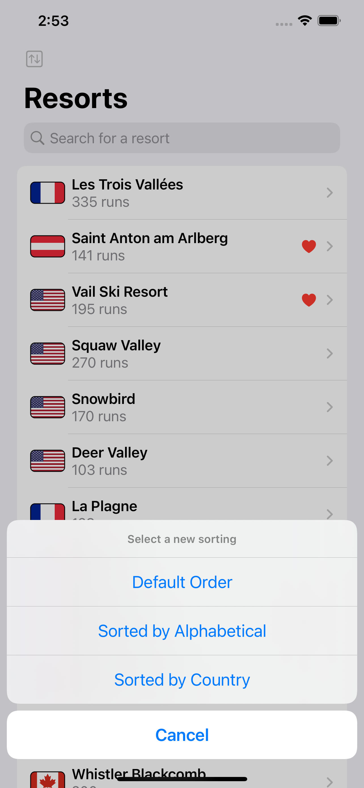 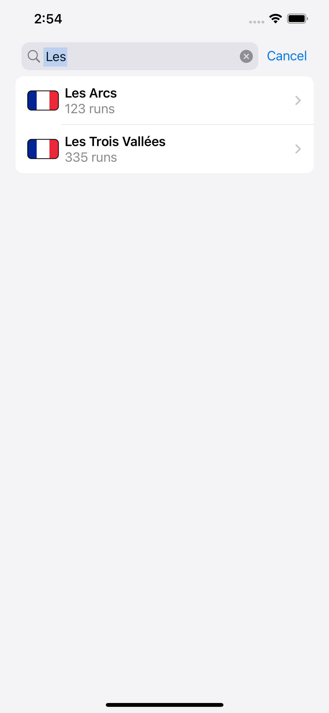 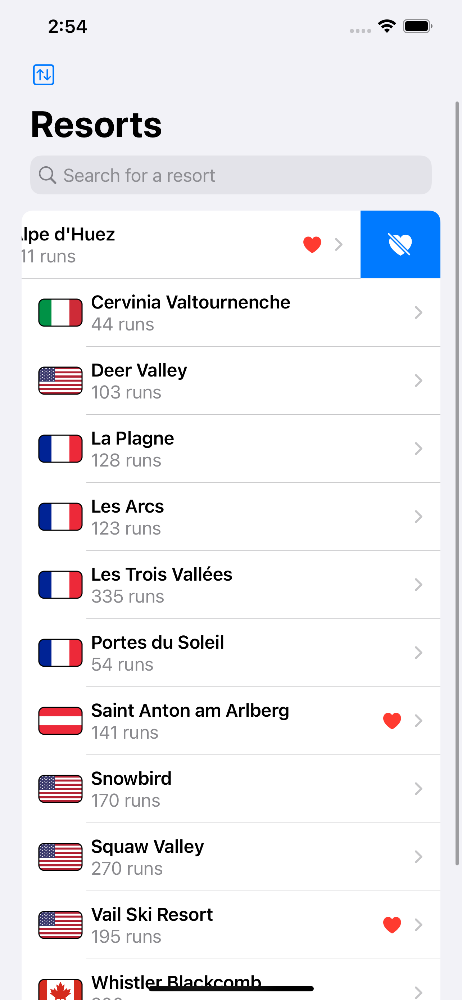 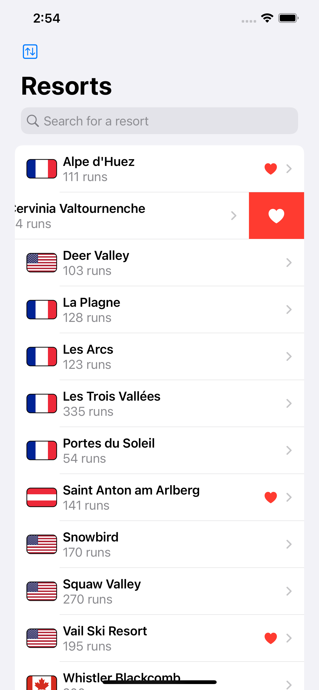  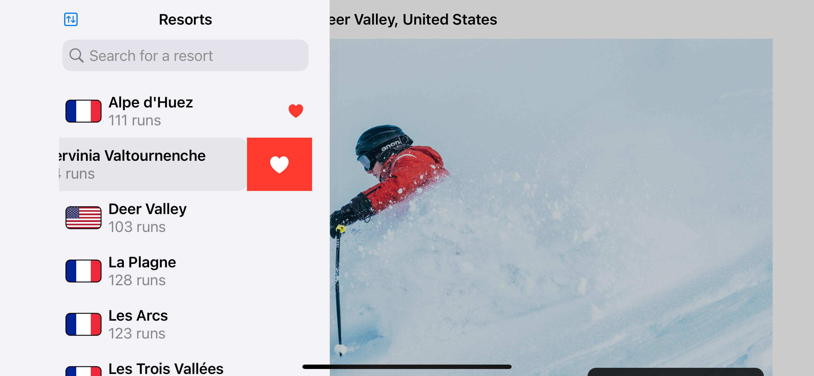 

Bu projenin ilgili sayfalarına aşağıdaki bağlantılardan ulaşabilirsin 👇
* [22.02.2022 2️⃣](https://canbi.me/22-02-2022-2-9539ae5ea52345d8bb7e4fd039d4f68a)

**SwiftUI öğrenme maceramın tamamına göz atmak istersen görsele tıklayabilirsin**👇

