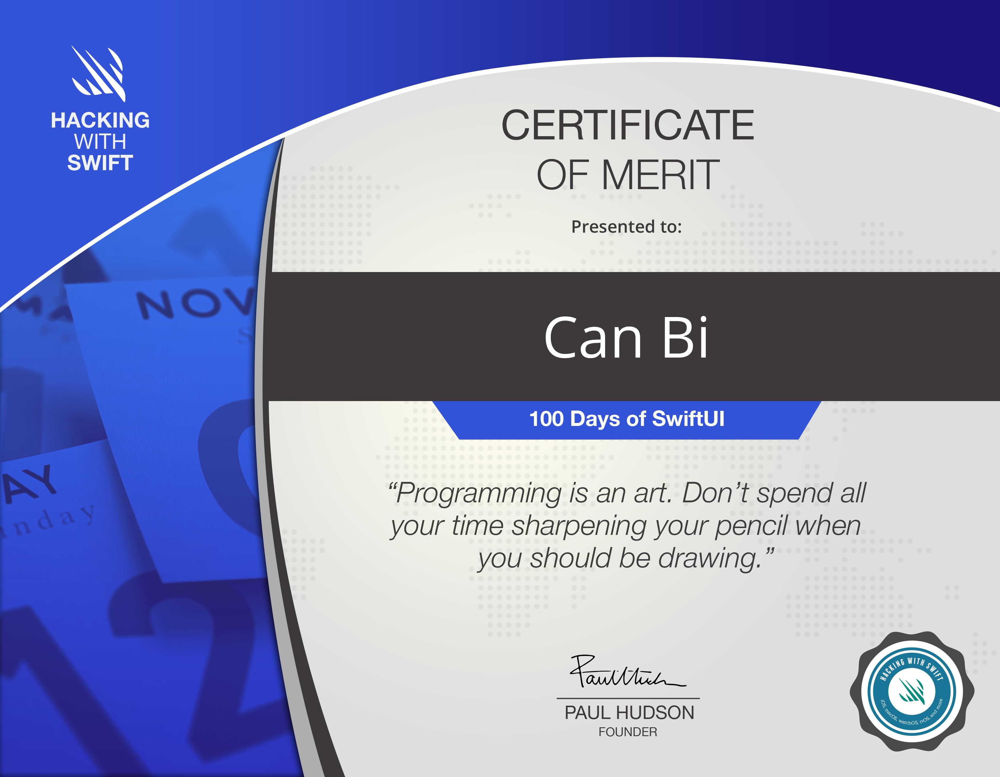

# Gün Gün SwiftUI Öğrenme Maceram 🚀

### Her Şey Nasıl Başladı❓
SwiftUI öğrenme macerama ilk başta [Hacking With Swift - 100 days of SwiftUI](https://www.hackingwithswift.com/100/swiftui) eğitimi ile başladım. 

Öğrenme maceramı aynı zamanda gün gün blogluyorum. Takip ettiğim diğer kaynak ve eğitimlerdeki projeleri bu repository'de bir araya getiriyorum. Her bir proje için verilen _Challange_'leri de bitirmeye çalışıyorum 🙌

### Takip Ettiğim Eğitimler, İçerikler ve Kaynaklar 📚
* [Hacking With Swift - 100 days of SwiftUI](https://www.hackingwithswift.com/100/swiftui) - **TAMAMLANDI** 🥳
* [SwiftUI Views Mastery (iOS 15)](https://www.bigmountainstudio.com/views-15)
* [Working with Data in SwiftUI](https://www.bigmountainstudio.com/data)

### SwiftUI öğrenme macerama göz atmak istersen görsele tıklayabilirsin👇

### Başarılar 🏆

